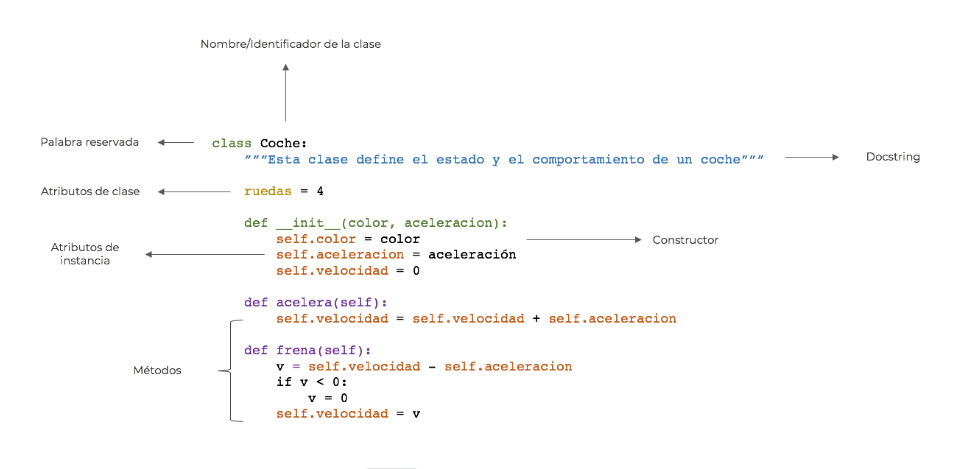
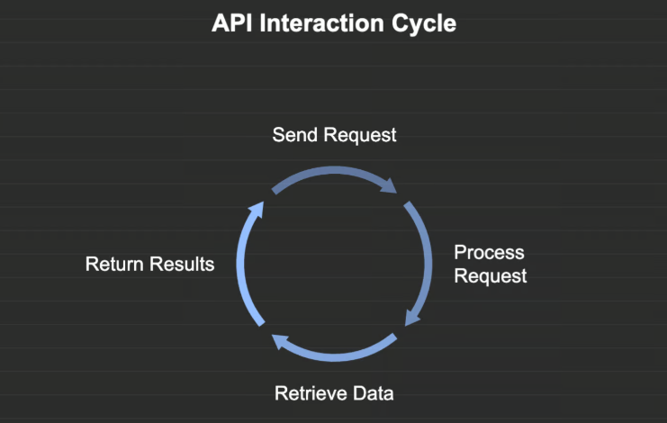
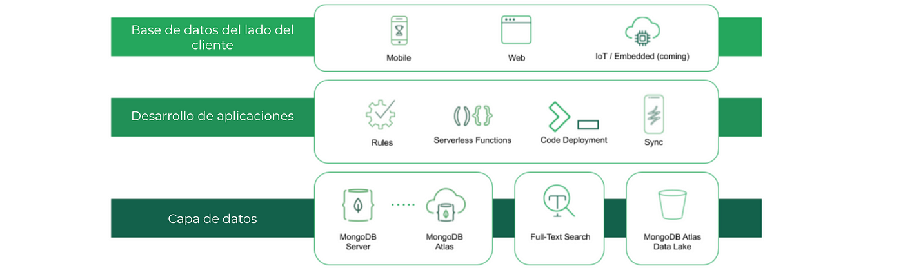
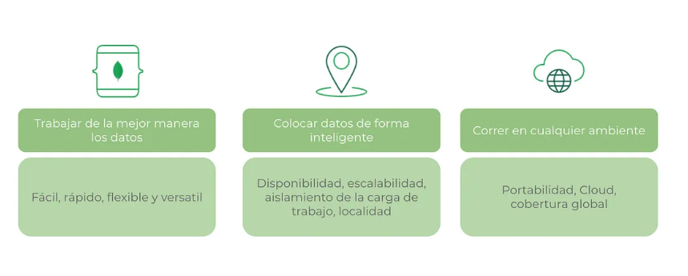

# Guía de Conceptos Fundamentales en Python


## Índice

## 1. [Las clases en Python](#1-las-clases-en-python)
### 1.1 [Crear una clase en Python](#11-crear-una-clase-en-python)
### 1.2 [Instanciar un objeto](#12-instanciar-un-objeto)
### 1.3 [Añadir atributos a una clase](#13-añadir-atributos-a-una-clase)
### 1.4 [Definir métodos en una clase](#14-definir-métodos-en-una-clase)
### 1.5 [Cómo pasar argumentos a los métodos](#15-cómo-pasar-argumentos-a-los-métodos)
### 1.6 [Ventajas y desventajas del uso de las clases en Python](#16-ventajas-y-desventajas-del-uso-de-las-clases-en-python)

## 2. [¿Qué método se ejecuta automáticamente cuando se crea una instancia de una clase?](#2-qué-método-se-ejecuta-automáticamente-cuando-se-crea-una-instancia-de-una-clase)
### 2.1 [Método constructor](#21-método-constructor)

## 3. [Introducción a las APIs en Python](#3-introducción-a-las-apis-en-python)
### 3.1 [¿Qué es una API?](#31-qué-es-una-api)
### 3.2 [¿Por qué son importantes las APIs?](#32-por-qué-son-importantes-las-apis)
### 3.3 [¿Qué es un endpoint en una API?](#33-qué-es-un-endpoint-en-una-api)
### 3.4 [Tipos de APIs](#34-tipos-de-apis)
### 3.5 [APIs web y REST](#35-apis-web-y-rest)
### 3.6 [Comprender los códigos de estado de la API de Python](#36-comprender-los-códigos-de-estado-de-la-api-de-python)
### 3.7 [Manejo de diferentes códigos de estado](#37-manejo-de-diferentes-códigos-de-estado)
### 3.8 [Ejemplo práctico](#38-ejemplo-práctico)

## 4. [¿Cuáles son los tres verbos de API?](#4-cuáles-son-los-tres-verbos-de-api)

## 5. [¿Es MongoDB una base de datos SQL o NoSQL?](#5-es-mongodb-una-base-de-datos-sql-o-nosql)
### 5.1 [Introducción](#51-introducción)
### 5.2 [¿Cómo funciona MongoDB?](#52-cómo-funciona-mongodb)
### 5.3 [¿Cómo funciona la búsqueda de texto de MongoDB?](#53-cómo-funciona-la-búsqueda-de-texto-de-mongodb)
### 5.4 [La arquitectura de MongoDB y sus componentes](#54-la-arquitectura-de-mongodb-y-sus-componentes)
### 5.5 [Tres ejemplos de consultas de MongoDB](#55-tres-ejemplos-de-consultas-de-mongodb)
### 5.6 [Ventajas de usar MongoDB](#56-ventajas-de-usar-mongodb)
### 5.7 [Principales diferencias SQL y NoSQL](#57-principales-diferencias-sql-y-nosql)

## 6. [¿Qué es Postman y para qué sirve?](#6-qué-es-postman-y-para-qué-sirve)
### 6.1 [Introducción](#61-introducción)
### 6.2 [Cómo funciona Postman](#62-cómo-funciona-postman)
### 6.3 [Ventajas respecto a otras herramientas](#63-ventajas-respecto-a-otras-herramientas)
### 6.4 [Métodos y primeros pasos con Postman](#64-métodos-y-primeros-pasos-con-postman)
### 6.5 [¿Por qué usar Postman?](#65-por-qué-usar-postman)

## 7. [¿Qué es el polimorfismo?](#7-qué-es-el-polimorfismo)
### 7.1 [Introducción a la herencia y el polimorfismo en Python](#71-introducción-a-la-herencia-y-el-polimorfismo-en-python)
### 7.2 [Tipos de polimorfismo en Python](#72-tipos-de-polimorfismo-en-python)

## 8. [¿Qué es un método dunder?](#8-qué-es-un-método-dunder)
### 8.1 [Principales Métodos Dunder](#81-principales-métodos-dunder)

## 9. [Decorador de Python](#9-decorador-de-python)
### 9.1 [Cómo Funciona un Decorador](#91-cómo-funciona-un-decorador)
### 9.2 [Decoradores con Argumentos](#92-decoradores-con-argumentos)
### 9.3 [Decoradores Anidados](#93-decoradores-anidados)
### 9.4 [Decoradores con Parámetros](#94-decoradores-con-parámetros)
### 9.5 [Uso de functools.wraps](#95-uso-de-functoolswraps)
### 9.6 [Aplicaciones Comunes de Decoradores](#96-aplicaciones-comunes-de-decoradores)


## 1. Las clases en Python

Python soporta la programación orientada a objetos (POO). Esto quiere decir que podemos definir entidades agrupando (encapsulando) sus `atributos` y `métodos` (comportamientos) en `clases`.



### 1.1  Crear una clase en Python

 Una `clase` es una plantilla que define la estructura y el comportamiento de los `objetos`, que son ` instancias` de esa clase. Gracias a las clases, es posible crear múltiples objetos con las mismas propiedades y métodos, pero con valores distintos en sus atributos.

Al ` definir una clase`, se establecen `atributos` y `métodos` que determinan cómo se comportarán sus instancias. Los objetos creados a partir de una clase pueden modificar su estado mediante estos métodos, permitiendo la manipulación y gestión eficiente de datos.

En Python, una clase se declara utilizando la palabra clave `class`, seguida del nombre de la clase y dos puntos `:`. La convención en Python es utilizar notación `PascalCase`, es decir, comenzar el nombre de la clase con `mayúscula` y el resto en minúsculas.

Dentro del cuerpo de la clase, se definen sus atributos y métodos, los cuales pueden ser `públicos` o `privados` según su nivel de acceso. Esta estructura permite organizar el código de manera más clara y reutilizable, facilitando el desarrollo de aplicaciones más complejas y escalables.

```python
class Persona:
	# atributos
	nombre = "Josune"
	edad = 24
	
	# metodos
	def presentacion(self):
		print(self.nombre + " tiene " + str(self.edad) + " años.")

persona_uno =	Persona()
persona_uno.presentacion()
```

📌 Explicación del código:

- hemos definido una `clase` llamada `persona`.
- añadimos los `atributos` de la `clase`, lo que significa que todos los objetos creados a partir de `Persona` compartirán estos valores por defecto.
- definimos un `método` llamado `presentacion()`, que se encarga de imprimir un mensaje con los valores de nombre y edad.
- `self` hace referncia al propio objeto que llame a este método.
- `self.nombre` y `self.edad` acceden a los atributos del objeto.
- `str(self.edad)` → se usa str() para convertir el número en cadena antes de concatenarlo.

### 1.2 Instanciar un objeto

En Python, la instanciación de objetos es el proceso mediante el cual creamos una instancia (un objeto concreto) a partir de una clase. Una clase es una plantilla que define atributos y métodos, mientras que un objeto es una instancia de esa plantilla con valores específicos. Para instanciar un objeto, utilizamos el nombre de la clase seguido de paréntesis, pasando los valores necesarios si el constructor (__init__) lo requiere.

```python
class Perro:
    def __init__(self, nombre, raza):
        self.nombre = nombre  # Atributo nombre
        self.raza = raza      # Atributo raza

    def ladrar(self):
        return f"{self.nombre} está ladrando. ¡Guau, guau!"

# Instanciación de objetos (crear perros)
perro1 = Perro("Max", "Labrador")
perro2 = Perro("Luna", "Bulldog")

# Llamando a un método de los objetos
print(perro1.ladrar())  # Output: Max está ladrando. ¡Guau, guau!
print(perro2.ladrar())  # Output: Luna está ladrando. ¡Guau, guau!
```

📌 Explicación del código::
- Definimos la clase Perro, que tiene dos atributos (nombre y raza) y un método (ladrar()).
- Creamos dos objetos (perro1 y perro2), pasando valores específicos a la clase Perro.
- Llamamos al método ladrar() para cada objeto, lo que imprime un mensaje personalizado.

❗ Conclusión:
La instanciación en Python nos permite crear múltiples objetos a partir de una clase, cada uno con sus propios datos, pero compartiendo los métodos definidos en la clase.

### 1.3 Añadir atributos a una clase

En Python, los atributos de una clase son variables que almacenan información relacionada con los objetos creados a partir de esa clase. Se pueden añadir de dos maneras: atributos de clase (compartidos por todas las instancias) y atributos de instancia (específicos de cada objeto).

1️⃣ `Atributos de Clase`

Son atributos definidos dentro de la clase pero fuera de cualquier método. Son compartidos por todas las instancias de la clase.

```python
class Coche:
    ruedas = 4  # Atributo de clase

# Crear dos objetos de la clase Coche
coche1 = Coche()
coche2 = Coche()

print(coche1.ruedas)  # Output: 4
print(coche2.ruedas)  # Output: 4
```

📌 Todos los objetos comparten el mismo valor del atributo ruedas.

2️⃣ `Atributos de Instancia`

Son atributos definidos dentro del método `__init__()` y pertenecen a cada objeto de la clase.

🔹 Ejemplo:

```python
class Coche:
    def __init__(self, marca, modelo):
        self.marca = marca  # Atributo de instancia
        self.modelo = modelo  # Atributo de instancia

# Crear dos objetos con atributos diferentes
coche1 = Coche("Toyota", "Corolla")
coche2 = Coche("Honda", "Civic")

print(coche1.marca, coche1.modelo)  # Salida: Toyota Corolla
print(coche2.marca, coche2.modelo)  # Salida: Honda Civic
```
📌 Cada objeto tiene sus propios valores en marca y modelo.

❗ Conclusión:

✅ Los atributos de clase son `compartidos` por todas las instancias.
✅ Los atributos de instancia son `únicos` para cada objeto.
✅ Usar `self` dentro del __init__() permite definir atributos específicos para cada objeto.

Además de la distinción entre `atributos de clase` e `instancia`, los atributos pueden tener diferentes `niveles de visibilidad`, que en Python se indican mediante convenciones de nomenclatura en lugar de palabras clave como en otros lenguajes de programación. Los atributos `private` y `protected` en Python se definen de manera diferente, y es importante conocer sus diferencias para seguir buenas prácticas de programación.

2️⃣ `Atributos private`

Un atributo private es aquel que no debe ser accesible desde fuera de la clase. Para declarar un atributo como privado en Python, se utiliza doble guion bajo (`__`) antes del nombre del atributo. Python aplica una técnica interna conocida como `name mangling`, que cambia el nombre del atributo para que no sea accesible directamente.

🔹 Ejemplo de atributo private:

```python
class Persona:
    def __init__(self, nombre, edad):
        self.__nombre = nombre  # Atributo privado
        self.__edad = edad  # Atributo privado

    def mostrar_informacion(self):
        return f"Nombre: {self.__nombre}, Edad: {self.__edad}"

# Crear una instancia de la clase
persona = Persona("Juan", 25)

# Acceder al atributo privado (esto genera un error)
# print(persona.__nombre)  # Error: AttributeError

# Acceder al atributo privado mediante el método de la clase
print(persona.mostrar_informacion())  # Salida: Nombre: Juan, Edad: 25
```

**¿Por qué usar atributos private?**

Se utilizan para encapsular la información de un objeto y asegurarse de que los datos sean manipulados solo por los métodos de la clase, protegiendo así la integridad del objeto.

2️⃣  `Atributos protected`
Los atributos protected son aquellos que deberían ser usados dentro de la clase y sus subclases, pero no desde fuera. En Python, los atributos protected se indican con un solo guion bajo (`_`) antes del nombre del atributo.

🔹 Ejemplo de atributo protected:

```python
class Vehiculo:
    def __init__(self, marca, modelo):
        self._marca = marca  # Atributo protegido
        self._modelo = modelo  # Atributo protegido

    def mostrar_informacion(self):
        return f"Marca: {self._marca}, Modelo: {self._modelo}"

# Crear una instancia de la clase
vehiculo = Vehiculo("Toyota", "Corolla")

# Acceder al atributo protegido (es posible pero no recomendable)
print(vehiculo._marca)  # Salida: Toyota
```
**¿Por qué usar atributos protected?**

El propósito de los atributos protegidos es que estén disponibles para las subclases, pero no para el código que usa la clase. Esto permite que los atributos sean manipulados dentro de la jerarquía de clases, pero fuera de ella no deben modificarse directamente.

🔹 Ejemplo con los diferentes tipos de atributos:

```python
class Vehiculo:
    # Atributo de clase
    tipo_vehiculo = "Automóvil"
    
    def __init__(self, marca, modelo):
        # Atributos de instancia
        self.marca = marca
        self.modelo = modelo
        self.__precio = 10000  # Atributo privado
        self._color = "Rojo"  # Atributo protegido
    
    def mostrar_informacion(self):
        return f"Marca: {self.marca}, Modelo: {self.modelo}"

# Crear una instancia de la clase
vehiculo = Vehiculo("Toyota", "Corolla")

# Acceder al atributo de clase
print(Vehiculo.tipo_vehiculo)  # Salida: Automóvil

# Acceder a los atributos de instancia
print(vehiculo.marca)  # Salida: Toyota

# Intentar acceder al atributo privado (esto generará un error)
# print(vehiculo.__precio)  # Error: AttributeError

# Acceder al atributo protegido (no recomendable fuera de la clase o subclases)
print(vehiculo._color)  # Salida: Rojo
```

**Resumen de los tipos de atributos:**

- `Atributos de clase`: Son comunes a todas las instancias y se definen fuera de los métodos, generalmente en la parte superior de la clase.
- `Atributos de instancia`: Están asociados a cada objeto creado a partir de la clase y se definen dentro del método __init__().
- `Atributos private`: Son para uso exclusivo dentro de la clase y no deben ser modificados o accedidos directamente desde fuera de la clase.
- `Atributos protected`: Están destinados para ser utilizados dentro de la clase y sus subclases, pero no deberían ser modificados fuera de estas.

### 1.4  Definir métodos en una clase

En Python, los métodos son funciones que se definen dentro de una clase y que operan sobre los objetos creados a partir de esa clase. Los métodos permiten manipular los atributos del objeto y definir su comportamiento.

Tipos de Métodos en una Clase
1️⃣ Métodos de Instancia → Usan self y trabajan con atributos del objeto.
2️⃣ Métodos de Clase → Usan @classmethod y cls para modificar atributos de clase.
3️⃣ Métodos Estáticos → Usan @staticmethod y no dependen de la instancia ni de la clase.

####  1.4.1 Métodos de Instancia
Son los más comunes y operan sobre un objeto específico.

🔹 Ejemplo:

```python
class Persona:
    def __init__(self, nombre, edad):
        self.nombre = nombre
        self.edad = edad

    def presentarse(self):  # Método de instancia
        return f"Hola, soy {self.nombre} y tengo {self.edad} años."

# Crear una instancia de Persona
persona1 = Persona("Carlos", 30)
print(persona1.presentarse())  # Salida: Hola, soy Carlos y tengo 30 años.
```

📌 Explicación:
- self.nombre y self.edad son atributos del objeto.
- presentarse() usa self para acceder a estos atributos.

#### 1.4.2 Métodos de Clase (@classmethod)

Modifican o acceden a atributos de clase en lugar de atributos de instancia.

🔹 Ejemplo:

```python
class Mascota:
    especie = "Perro"  # Atributo de clase

    @classmethod
    def cambiar_especie(cls, nueva_especie):
        cls.especie = nueva_especie

# Llamar al método de clase sin instanciar
Mascota.cambiar_especie("Gato")
print(Mascota.especie)  # Salida: Gato
```

📌 Explicación:

- @classmethod permite modificar especie, que es un atributo de clase.
- Se usa cls en lugar de self para referirse a la clase

#### 1.4.3 Métodos Estáticos (@staticmethod)

No dependen ni de la clase ni de la instancia. Se usan para utilidades.

🔹 Ejemplo:

```python
class Calculadora:
    @staticmethod
    def sumar(a, b):
        return a + b

# Llamar al método sin necesidad de crear una instancia
print(Calculadora.sumar(5, 3))  # Salida: 8
```

📌 Explicación:
- @staticmethod define un método independiente.
- No usa self ni cls, ya que no accede a atributos del objeto ni de la clase.

❗ Conclusión:

✅ Métodos de Instancia → Usan self y operan sobre el objeto.
✅ Métodos de Clase → Usan @classmethod y cls para modificar atributos de clase.
✅ Métodos Estáticos → Usan @staticmethod y no dependen de la clase ni de la instancia.

### 1.5 Cómo pasar argumentos a los métodos

En Python, los métodos dentro de una clase pueden recibir argumentos adicionales además de self, lo que permite que interactúen con datos específicos proporcionados por el usuario. Dependiendo del tipo de método, los argumentos se manejan de distintas formas.

1️⃣ Pasar Argumentos a Métodos de Instancia

Los métodos de instancia reciben self como primer parámetro y pueden aceptar otros argumentos personalizados para operar sobre atributos específicos del objeto.

🔹 Ejemplo:

```python
class Calculadora:
    def sumar(self, a, b):  # Método con argumentos
        return a + b

# Crear una instancia de la clase
calc = Calculadora()

# Llamar al método pasando dos argumentos
resultado = calc.sumar(5, 3)
print(resultado)  # Salida: 8
```

📌 Explicación:

- sumar(self, a, b) recibe dos números como argumentos (a y b).
- Se llama al método con calc.sumar(5, 3), pasando los valores 5 y 3.
- Devuelve 8, que es la suma de los dos valores.

2️⃣ Pasar Argumentos al Constructor (__init__)

El método __init__() permite inicializar un objeto con valores específicos al momento de su creación.

🔹 Ejemplo:

```python
class Persona:
    def __init__(self, nombre, edad):  # Recibe argumentos
        self.nombre = nombre
        self.edad = edad

    def presentar(self):
        return f"Hola, soy {self.nombre} y tengo {self.edad} años."

# Crear instancias con diferentes argumentos
persona1 = Persona("Carlos", 30)
persona2 = Persona("Ana", 25)

print(persona1.presentar())  # Salida: Hola, soy Carlos y tengo 30 años.
print(persona2.presentar())  # Salida: Hola, soy Ana y tengo 25 años.
```

📌 Explicación:

- __init__(self, nombre, edad) recibe nombre y edad al crear un objeto.
- Se almacenan en self.nombre y self.edad.
- Cada instancia (persona1, persona2) tiene atributos personalizados.

3️⃣ Pasar Argumentos a Métodos de Clase (@classmethod)

Los métodos de clase (@classmethod) reciben cls en lugar de self y pueden aceptar otros argumentos para modificar atributos de clase.

🔹 Ejemplo:

```python
class Configuracion:
    idioma = "Español"  # Atributo de clase

    @classmethod
    def cambiar_idioma(cls, nuevo_idioma):  # Método de clase con argumento
        cls.idioma = nuevo_idioma

# Cambiar el atributo de clase pasando un argumento
Configuracion.cambiar_idioma("Inglés")
print(Configuracion.idioma)  # Salida: Inglés
```

📌 Explicación:

- cambiar_idioma(cls, nuevo_idioma) recibe el idioma como argumento.
- Modifica cls.idioma, que es un atributo de la clase.

4️⃣ Pasar Argumentos a Métodos Estáticos (@staticmethod)

Los métodos estáticos (@staticmethod) pueden recibir cualquier número de argumentos, pero no tienen acceso a self ni cls.

🔹 Ejemplo:

```python
class Conversor:
    @staticmethod
    def convertir_celsius_a_fahrenheit(celsius):
        return (celsius * 9/5) + 32

# Pasando un argumento al método estático
print(Conversor.convertir_celsius_a_fahrenheit(25))  # Salida: 77.0
```

📌 Explicación:

- convertir_celsius_a_fahrenheit(celsius) recibe celsius como argumento.
- Devuelve la conversión sin necesidad de crear una instancia de la clase.

❗ Conclusión:

✅ Métodos de Instancia → Pasan argumentos a través de self y operan sobre el objeto.
✅ Constructor (__init__) → Permite inicializar objetos con valores personalizados.
✅ Métodos de Clase (@classmethod) → Reciben cls y pueden modificar atributos de clase.
✅ Métodos Estáticos (@staticmethod) → Aceptan argumentos, pero no dependen de la clase ni del objeto.

### 1.6 Ventajas y desventajas del uso de las clases en Python

✅ Ventajas:
- Reutilización de Código: Permiten la creación de objetos a partir de una plantilla, evitando la duplicación de código.
- Encapsulamiento: Facilitan la organización y protección de datos mediante atributos privados y públicos.
- Modularidad: Facilitan el mantenimiento y la escalabilidad de programas grandes.
- Herencia: Se pueden crear nuevas clases basadas en clases existentes, promoviendo la reutilización y especialización del código.
- Polimorfismo: Permiten definir métodos con el mismo nombre en diferentes clases para adaptarse a distintos tipos de datos.

❌ Desventajas:
- Mayor Complejidad: Para proyectos muy simples, el uso de clases puede añadir una capa innecesaria de complejidad.
- Uso de Memoria: Cada instancia de una clase consume memoria, lo que puede ser menos eficiente en algunos casos que una estructura funcional.
- Curva de Aprendizaje: Para principiantes, entender conceptos como herencia, encapsulamiento y polimorfismo puede ser desafiante.
- Ejecución Más Lenta: Comparado con enfoques puramente funcionales, el uso de clases puede generar una ligera sobrecarga en la ejecución del programa.

---

## 2. ¿Qué método se ejecuta automáticamente cuando se crea una instancia de una clase?

En Python, el método que se ejecuta automáticamente al crear una instancia de una clase es el `método constructor`, denominado `__init__()`. Este método se encarga de inicializar los atributos del objeto y establecer su estado inicial.

### 2.1 Método constructor
El método `__init__` es el constructor de una clase en Python.

1️⃣ ¿Qué es el método __init__()?

El método __init__() es un método especial que pertenece a la clase y se ejecuta de forma automática cuando se instancia un objeto. Su propósito principal es asignar valores iniciales a los atributos del objeto.

Ejemplo básico:

```python
class Persona:
    def __init__(self, nombre, edad):  # Constructor con parámetros
        self.nombre = nombre
        self.edad = edad
        print("Se ha creado una nueva persona")

# Crear una instancia de la clase Persona
persona1 = Persona("Carlos", 30)
print(persona1.nombre)  # Salida: Carlos
print(persona1.edad)    # Salida: 30
```

📌 Explicación:

- __init__(self, nombre, edad) recibe los valores nombre y edad al instanciar la clase.
- self.nombre = nombre y self.edad = edad asignan esos valores a los atributos del objeto.
- Al crear persona1, automáticamente se ejecuta el __init__(), mostrando el mensaje "Se ha creado una nueva persona".

2️⃣ ¿Es obligatorio definir el método __init__()?

No es obligatorio, pero si no se define, la clase usará un constructor por defecto sin parámetros y sin inicializar atributos.

🔹 Ejemplo sin __init__():

```python
class Vehiculo:
    pass

coche = Vehiculo()  # Se crea el objeto sin inicialización
print(coche)  # Salida: <__main__.Vehiculo object at 0x...>
```

🔹 Ejemplo con __init__() para inicializar atributos:

```python
class Vehiculo:
    def __init__(self, marca):
        self.marca = marca

coche = Vehiculo("Toyota")
print(coche.marca)  # Salida: Toyota
```

📌 Explicación:
-Cuando no definimos el método __init__() en una clase, como en el primer ejemplo, Python utiliza un constructor por defecto que no inicializa ningún atributo ni recibe parámetros adicionales. El objeto se crea, pero sin atributos específicos.
- En cambio, al definir __init__() como en el segundo ejemplo, podemos inicializar atributos al momento de crear el objeto, proporcionando valores específicos a través de los parámetros del constructor. Esto da más control y flexibilidad sobre cómo se crean y configuran los objetos.

En resumen, la diferencia es que definir __init__() permite inicializar atributos con valores personalizados, mientras que no definirlo crea objetos sin inicialización de atributos.

3️⃣ Personalización del __init__()

Podemos personalizar __init__() para incluir valores por defecto o validaciones.

🔹 Ejemplo con valores por defecto:

```python
class Producto:
    def __init__(self, nombre="Desconocido", precio=0):
        self.nombre = nombre
        self.precio = precio

producto1 = Producto("Laptop", 1200)
producto2 = Producto()  # Usa valores por defecto

print(producto1.nombre, producto1.precio)  # Salida: Laptop 1200
print(producto2.nombre, producto2.precio)  # Salida: Desconocido 0
```

📌 Explicación:
Si no se proporcionan valores al instanciar Producto(), tomará "Desconocido" y 0 por defecto.

Conclusión:

✅ El método __init__() es el constructor en Python y se ejecuta automáticamente al crear una instancia de una clase.
✅ Es útil para inicializar atributos y personalizar el estado del objeto desde su creación.
✅ No es obligatorio, pero proporciona flexibilidad y estructura a la programación orientada a objetos.

---

## 3. Introducción a las APIs en Python

API significa "Application Programming Interface" o "Interfaz de Programación de Aplicaciones" en español. En términos simples, una API es un conjunto de reglas y definiciones que permiten que dos programas de software se comuniquen entre sí.



### 3.1 ¿Qué es una API?

Una API es como un puente entre diferentes aplicaciones de software. Permite que estas aplicaciones se comuniquen y compartan información entre sí. Utilizar APIs en Python es una forma potente de interactuar con servicios externos, recuperar datos e integrar diversas funcionalidades en tus aplicaciones. Python hace que trabajar con las API sea sencillo y eficaz, principalmente a través de la biblioteca de peticiones , que te permite enviar peticiones HTTP para interactuar con las API.

Las APIs están en todas partes. Cada vez que utilizas una aplicación en tu teléfono, accedes a un sitio web o envías un mensaje, estás interactuando, en muchos casos, con una API.

### 3.2 ¿Por qué son importantes las APIs?

Las APIs permiten que los desarrolladores usen funcionalidades ya existentes sin necesidad de programarlas desde cero. Esto facilita la integración de servicios y mejora la eficiencia del desarrollo de software.

Algunos usos comunes de las APIs incluyen:
- Obtener datos del clima desde un servicio en línea.
- Integrar un sistema de pago como PayPal o Stripe en una aplicación.
- Usar Google Maps para mostrar ubicaciones en una aplicación.

Una API es un conjunto de reglas que define cómo dos aplicaciones pueden comunicarse entre sí.

### 3.3 ¿Qué es un endpoint en una API?

Un endpoint es una URL específica dentro de una API que permite acceder a una función o recurso determinado. Cada endpoint representa una acción o un conjunto de datos accesibles a través de la API.

Por ejemplo, en la API de JSONPlaceholder:
- https://jsonplaceholder.typicode.com/posts devuelve una lista de publicaciones.
- https://jsonplaceholder.typicode.com/posts/1 devuelve una publicación específica con ID 1.
- https://jsonplaceholder.typicode.com/users devuelve una lista de usuarios.

Los endpoints permiten estructurar la API para que diferentes partes de una aplicación puedan acceder a datos de manera organizada y eficiente.

### 3.4 Tipos de APIs

UExisten diferentes tipos de APIs, pero las más comunes son:
- APIs locales: Se usan dentro de un mismo programa o sistema operativo.
- APIs web: Permiten la comunicación entre aplicaciones a través de internet (por ejemplo, REST y SOAP).
- APIs de bibliotecas: Se incluyen en paquetes de software para facilitar ciertas funciones.

### 3.5 APIs web y REST
Las APIs web son muy populares porque permiten que diferentes sistemas se comuniquen a través de internet. Un tipo común de API web es la API REST (Representational State Transfer). 
Estas APIs usan el protocolo HTTP para realizar operaciones como:
- GET: Obtener datos.
- POST: Enviar datos.
- PUT: Actualizar datos.
- DELETE: Eliminar datos.

### 3.6 Comprender los códigos de estado de la API de Python

Los códigos de estado de la API son respuestas estandarizadas que los servidores devuelven para indicar el resultado de la solicitud de un cliente. Estos códigos ayudan a los desarrolladores a saber si una solicitud se ha realizado correctamente, si se ha producido un error o si es necesario realizar alguna otra acción. 

Códigos de estado comunes:
- `200 OK`: Este código de estado indica que la solicitud se ha realizado correctamente. Por ejemplo, cuando haces una petición GET para recuperar datos de una API, una respuesta 200 OK significa que los datos se han obtenido correctamente.  
- `404 No encontrado`: Este código se devuelve cuando el servidor no puede encontrar el recurso solicitado. Por ejemplo, si intentas acceder a un punto final que no existe, recibirás un error 404 Not Found.
- `500 Error interno del servidor`: Este código indica que algo ha ido mal en el servidor. Es un mensaje de error genérico que puede producirse por diversas causas, como fallos en el código del servidor o problemas con la base de datos.

### 3.7 Manejo de diferentes códigos de estado

Manejar eficazmente los códigos de estado de la API en tus aplicaciones Python garantiza que tu código se comporte de forma predecible y pueda gestionar los errores con elegancia. 

- Si la respuesta es `200`, procede a procesar los datos devueltos.

- Cuando te encuentres con un error `404`, comprueba si la URL del punto final es correcta y, si es necesario, implementa una lógica alternativa o informa al usuario de que el recurso no está disponible. 

- Para los errores `500`, considera reintentar la petición tras un breve retraso o registrar el error para una investigación posterior. Sin embargo, evita reintentos excesivos para no sobrecargar el servidor.

### 3.8 Ejemplo práctico:

Vamos a ver un ejemplo básico de cómo utilizar una API en Python. Usaremos la API de JSONPlaceholder, que proporciona datos ficticios para pruebas.

```python
import requests

# URL de la API
url = "https://jsonplaceholder.typicode.com/posts/1"

# Hacemos una solicitud GET
respuesta = requests.get(url)

# Convertimos la respuesta a formato JSON
datos = respuesta.json()

# Mostramos los datos obtenidos
print(datos)
```

📌 Explicación del código:
- Importamos la biblioteca requests para hacer solicitudes HTTP.
- Definimos la URL de la API.
- Hacemos una solicitud GET para obtener información.
- Convertimos la respuesta a formato JSON.
- Imprimimos los datos obtenidos.

Cuando ejecutamos este código, obtenemos una respuesta en formato JSON como esta:

```python
{
  "userId": 1,
  "id": 1,
  "title": "sunt aut facere repellat provident occaecati excepturi optio reprehenderit",
  "body": "quia et suscipit..."
}
```

❗ Conclusión:
Las APIs son herramientas fundamentales en la programación moderna. Nos permiten acceder a datos y funcionalidades de otros servicios sin necesidad de programarlos desde cero. Aprender a trabajar con APIs es una habilidad esencial para cualquier desarrollador.

---

## 4. ¿Cuáles son los tres verbos de API?

En el contexto de una API, existen tres verbos principales que se utilizan para interactuar con los recursos de la aplicación o servicio. Estos verbos corresponden a los métodos HTTP más comunes y son fundamentales para realizar operaciones de lectura, escritura, actualización y eliminación de datos. Los tres verbos más importantes de una API son:

1️⃣ `GET` (Obtener datos)
El verbo GET se utiliza para obtener datos de un recurso específico sin modificarlo. Este es el método más común, utilizado para recuperar información desde el servidor hacia el cliente. Las solicitudes GET deben ser seguras y no tener efectos secundarios en el servidor.

- Propósito: Recuperar información de la API.
- Ejemplo: Obtener la lista de usuarios de una base de datos.

```http
GET https://api.ejemplo.com/usuarios
```
- Respuesta típica (si tiene éxito):

```json
[
  {"id": 1, "nombre": "Juan Pérez", "email": "juan@example.com"},
  {"id": 2, "nombre": "Ana García", "email": "ana@example.com"}
]
```

2️⃣	`POST` (Crear datos)
El verbo POST se utiliza para enviar datos al servidor con el fin de crear un nuevo recurso. A diferencia de GET, que solo lee datos, POST se utiliza para enviar información que puede causar efectos secundarios, como agregar un nuevo registro a una base de datos.

- Propósito: Enviar datos para crear un nuevo recurso.
- Ejemplo: Crear un nuevo usuario en la base de datos

```http
POST https://api.ejemplo.com/usuarios
Content-Type: application/json

{
  "nombre": "Carlos López",
  "email": "carlos@example.com"
}
```
- Respuesta típica (si la creación fue exitosa):

```json
{
  "id": 3,
  "nombre": "Carlos López",
  "email": "carlos@example.com"
}
```

3️⃣	`PUT` (Actualizar datos)
El verbo PUT se utiliza para actualizar un recurso existente. A diferencia de POST, que se usa para crear nuevos recursos, PUT reemplaza completamente un recurso con los datos enviados. Si el recurso no existe, PUT generalmente lo crea.

- Propósito: Actualizar un recurso existente.
- Ejemplo: Actualizar la información de un usuario existente.
```http
PUT https://api.ejemplo.com/usuarios/1
Content-Type: application/json

{
  "nombre": "Juan Pérez",
  "email": "juan.nuevo@example.com"
}
```
- Respuesta típica (si la actualización fue exitosa):

```json
{
  "id": 1,
  "nombre": "Juan Pérez",
  "email": "juan.nuevo@example.com"
}
```

Además de los tres verbos principales que mencionamos anteriormente (GET, POST y PUT), añadiría uno más que también me parece fundamental, se trata del verbo DELETE.

4️⃣	`DELETE` (Eliminar datos)
El verbo DELETE se utiliza para eliminar un recurso específico del servidor. Este verbo borra datos de forma permanente y debe usarse con cuidado, ya que la eliminación no es reversible.

- Propósito: Eliminar un recurso.
- Ejemplo: Eliminar un usuario de la base de datos.

```http
DELETE https://api.ejemplo.com/usuarios/1
```
- Respuesta típica (si la eliminación fue exitosa):

```json
{
  "mensaje": "Usuario eliminado con éxito."
}
```

Este verbo es esencial en las APIs RESTful, ya que completa el conjunto de operaciones CRUD (Crear, Leer, Actualizar, Eliminar) que permiten interactuar completamente con los recursos de una aplicación o servicio.

## 5. ¿Es MongoDB una base de datos SQL o NoSQL?

`MongoDB` es una `base de datos` de documentos diseñada para facilitar el desarrollo y la escalabilidad horizontal, con un modelo de consultas e indexación avanzado.

Su nombre proviene de `“humongous”` que podría traducirse como “enorme”. MongoDB es una base de datos `NOSQL`, escrita en C++ y utiliza `MQL(Mongo Query Language)` para las consultas.



### 5.1 Introducción
MongoDB es una base de datos NoSQL de código abierto. Como base de datos no relacional, puede procesar datos estructurados, semiestructurados y no estructurados. Utiliza un modelo de datos no relacional orientado a documentos y un lenguaje de consulta no estructurado.

MongoDB es muy flexible y permite combinar y almacenar múltiples tipos de datos. También almacena y maneja mayores cantidades de datos que las bases de datos relacionales tradicionales. MongoDB usa un formato de almacenamiento de documentos llamado BSON, que es una forma binaria de JSON (JavaScript Object Notation o notación de objetos de JavaScript) que puede acomodar más tipos de datos.

### 5.2 ¿Cómo funciona MongoDB?

MongoDB almacena objetos de datos en colecciones y documentos en lugar de las tablas y filas que se utilizan en las bases de datos relacionales tradicionales. Las colecciones comprenden conjuntos de documentos, que son equivalentes a tablas en una base de datos relacional. Los documentos consisten en pares clave-valor, que son la unidad básica de datos en MongoDB.

La estructura de un documento se puede cambiar simplemente añadiendo campos nuevos o eliminando los existentes. Los documentos pueden definir una clave principal como identificador único y los valores pueden ser una variedad de tipos de datos, incluidos otros documentos, matrices y matrices de documentos.

### 5.3 ¿Cómo funciona la búsqueda de texto de MongoDB?

Una función clave de MongoDB es la búsqueda de texto, que permite consultar campos de cadena para texto o palabras específicas. Se puede realizar una búsqueda de texto usando un índice de texto o el operador $text.

Un índice de texto puede ser una cadena o una matriz de elementos de cadena. Para hacer una consulta de búsqueda de texto, la colección debe contener un índice de texto. Una colección solo puede tener un índice de texto y un único índice de texto se puede aplicar a varios campos.

También se puede efectuar una búsqueda en una colección con un índice de texto usando el operador $text. El operador $text tokeniza cada cadena de búsqueda con espacios en blanco y trata todos los signos de puntuación excepto "–" y "\" como delimitadores. Después de tokenizar la cadena de búsqueda, el operador realiza la operación lógica OR en los tokens.

### 5.4 La arquitectura de MongoDB y sus componentes

MongoDB tiene tres principios o diseños básicos:
- El modelo de datos de documentos está pensada para `trabajar de la mejor manera los datos`.
- Tiene un diseño de sistemas distribuidos, donde nos va a permitir `colocar los datos de forma inteligente`.
- Puede `correr en cualquier ambiente`, permitiendo eliminar el bloqueo de los proveedores.




### 5.5 Tres ejemplos de consultas de MongoDB

MongoDB utiliza MongoDB Query Language (MQL) para recuperar datos de la base de datos. Es fácil de usar y funciona de manera similar a SQL con operaciones CRUD para crear, leer, actualizar y eliminar documentos. Los nombres de las funciones siguen la sintaxis:

```javascript
<database>.<collection_name>. <operation>.
```

A continuación se muestran tres ejemplos prácticos:

**1️⃣ INSERT: Crear o insertar un nuevo documento en una colección**

Si la colección no existe, se creará una nueva colección.

```javascript
// Insertar un documento en una colección
db.collection.insertOne({ nombre: "Marta", apellido: "Casas" });

// Insertar varios documentos en una colección
db.collection.insertMany([
    { nombre: "Juan", apellido: "Pérez" },
    { nombre: "Ana", apellido: "López" }
]);
```
Así es como se ve la inserción de un documento en la colección del cliente:

```javascript
db.customer.insertOne(
    {
        firstname: "Marta",
        lastname: "Casas",
        address: "Calle Petunias 232, Ciempozuelos, Madrid, 28350"
    }
)
```

**2️⃣ FIND: Consultar una colección de documentos**

Se pueden aplicar criterios y filtros de consulta para encontrar documentos específicos.
```javascript
db.collection.find()
```

El siguiente código encuentra todos los documentos en la colección del cliente:
```javascript
db.collection.find()
```

**3️⃣ UPDATE: Modificar documentos existentes en una colección**

```javascript
// Actualizar un solo documento
db.collection.updateOne(
    { nombre: "Marta" },
    { $set: { direccion: "Calle Lavanda 5, Ciempozuelos, Madrid, 28350" } }
);

// Actualizar múltiples documentos
db.collection.updateMany(
    { ciudad: "Madrid" },
    { $set: { pais: "España" } }
);
```

Así es como actualizaría un documento en la colección de clientes:
```javascript
db.customer.updateOne(
    { firstname: "Marta" },
    {
        $set: { "address": "Calle Lavanda 5, Ciempozuelos, Madrid, 28350" }
    }
)
```

### 5.6 Ventajas de usar mongoDB:

1️⃣ `Flexibilidad`
MongoDB tiene una arquitectura de esquema dinámico que funciona con almacenamiento y datos no estructurados. Como los datos se almacenan en documentos flexibles similares a JSON, el esquema de la base de datos no tiene que estar predefinido y los esquemas se pueden modificar dinámicamente sin causar tiempo de inactividad.

Con el formato de datos BSON de MongoDB, los objetos en una colección pueden tener diferentes conjuntos de campos, y casi cualquier tipo de estructura de datos se puede modelar y manipular. Por esta razón, el modelo de base de datos flexible de MongoDB es especialmente beneficioso a medida que cambian los requisitos de negocio y de datos.

2️⃣ `Fragmentación`
MongoDB ofrece escalabilidad horizontal a través de un proceso llamado fragmentación. La fragmentación divide los datos de un gran conjunto de datos y los distribuye entre varios servidores. Si un servidor no puede gestionar una gran carga de datos, puede dividirse y distribuirse automáticamente sin interrumpir el procesamiento de datos.

3️⃣ `Mayor Rendimiento`
MongoDB almacena los datos en RAM para poder acceder más rápidamente a ellos y conseguir un mayor rendimiento al ejecutar consultas. Recopila los datos directamente de la RAM en lugar del disco duro, lo que hace que la lectura y escritura de datos sea más rápida. La estructura de datos no relacional de MongoDB también implica que necesita menos potencia de procesamiento para buscar y recuperar datos que una base de datos relacional.

### 5.7 Principales diferencias SQL y NoSQL

1️⃣ Estructura de datos
- SQL usa tablas con filas y columnas.
- NoSQL usa documentos, clave-valor, grafos o columnas anchas.

2️⃣	 Lenguaje de consulta
- SQL usa Structured Query Language (SQL).
- NoSQL varía según la base de datos (ej. MongoDB usa MQL).

Ejemplo:
SQL:

```sql
SELECT * FROM usuarios WHERE nombre = 'Juan';

```

NoSQL (MongoDB):

```javascript
db.usuarios.find({ nombre: "Juan" });

```

3️⃣	 Esquema de datos
- SQL tiene un esquema rígido (estructura fija).
- NoSQL tiene un esquema flexible (puede variar entre documentos).

4️⃣	. Escalabilidad
- SQL escala verticalmente (mejorando el hardware).
- NoSQL escala horizontalmente (distribuyendo datos entre servidores).

5️⃣	 Integridad y transacciones
- SQL sigue ACID (mayor seguridad y consistencia).
- NoSQL sigue BASE (más rápido, pero con menor consistencia inmediata).

#### 5.7.1 Cuándo utilizar uno u otro
Cuando se trata de elegir entre SQL y NoSQL, la decisión depende en gran medida del tipo de datos que se manejarán y de los requisitos del sistema:

- **SQL** es ideal cuando se trabaja con datos altamente estructurados y bien definidos, como registros financieros, bases de datos de clientes con relaciones complejas o sistemas que requieren transacciones seguras y consistentes.

- **NoSQL** es preferible cuando se manejan datos no estructurados o semiestructurados, como documentos JSON, big data, contenido multimedia o aplicaciones en la nube que requieren escalabilidad horizontal.


## 6. ¿Qué es Postman y para qué sirve?

En el mundo del desarrollo web y de aplicaciones móviles, la interacción con APIs (Interfaz de Programación de Aplicaciones) es una parte fundamental del proceso. Las APIs permiten la comunicación entre diferentes servicios y aplicaciones, lo que facilita la integración de funcionalidades complejas en proyectos. Sin embargo, probar y gestionar estas interacciones puede ser un desafío, especialmente cuando se manejan múltiples entornos y solicitudes. Aquí es donde entra en juego Postman, una herramienta que ha revolucionado la forma en que los desarrolladores trabajan con APIs.

### 6.1 Introducción

Postman es una herramienta de colaboración y desarrollo que permite a los desarrolladores interactuar y probar el funcionamiento de servicios web y aplicaciones. proporcionando una interfaz gráfica intuitiva y fácil de usar para enviar solicitudes a servidores web y recibir las respuestas correspondientes

Con esta plataforma se puede gestionar diferentes entornos de desarrollo, organizar las solicitudes en colecciones y realizar pruebas automatizadas para verificar el comportamiento de los sistemas.
Postman es utilizado por los desarrolladores para testear colecciones y catálogos APIs (tanto a nivel front-end como back-end), para gestionar el ciclo de vida de las APIs, mejorar el trabajo colaborativo y mejorar la organización del proceso de diseño y desarrollo.

- Posibilidad de enviar diferentes tipos de solicitudes HTTP (GET, POST, PUT, DELETE, etc.).
- Soporte para autenticación y encabezados personalizados.
- Colecciones para organizar y reutilizar solicitudes.
- Generación de código en varios lenguajes de programación.

### 6.2 Cómo funciona Postman

Este entorno ofrece una GUI que facilita a los desarrolladores el envío de solicitudes HTTP y HTTPS a una API y a gestionar las respuestas recibidas.

Las principales características y funcionalidades de Postman son:

- `Envío de solicitudes`. Permite enviar solicitudes GET, POST, PUT, DELETE y otros métodos HTTP a una API especificando los parámetros, encabezados y cuerpo de la solicitud.
- `Gestión de entornos`. Facilita la configuración para diferentes entornos (por ejemplo, desarrollo, prueba, producción) y el cambio sencillo entre ellos (para realizar pruebas y desarrollo en diferentes contextos).
- `Colecciones de solicitudes`. Agrupa las solicitudes relacionadas en colecciones, lo que facilita la organización y ejecución de pruebas automatizadas.
- `Pruebas automatizadas`. Es ideal para crear y ejecutar pruebas automatizadas para verificar el comportamiento de una API (detectar errores e incrementar la calidad del software).
- `Documentación de API`. Genera de forma automatizada, documentación detallada de la API a partir de las solicitudes y respuestas realizadas, lo que facilita su comprensión y uso por parte de otros desarrolladores.

### 6.3 Ventajas respecto a otras herramientas

Cada vez son más los desarrolladores y programadores que apuestan por un entorno como Postman para automatizar pruebas y mejorar sus procesos de trabajo. Los principales beneficios que se obtienen con esta herramienta son:

- `Facilidad a la hora de trabajar` al disponer de una interfaz gráfica de usuario intuitiva, sencilla y personalizable.
- `Amplia compatibilidad con numerosas tecnologías y protocolos web`, como por ejemplo; HTTP, HTTPS, REST, SOAP, GraphQL… (lo que permite interaccionar con diversos tipos de API sin complicaciones o problemas).
- Ofrece una `amplia gama de funcionalidades para diseñar, probar y documentar APIs`, siendo probablemente la solución más completa del mercado para gestionar el ciclo de vida completo de desarrollo de APIs.
- `Fomenta y facilita la colaboración` entre los miembros del equipo de desarrollo (con opciones interesantes como compartir colecciones de solicitudes con otros desarrolladores).
- Cuenta con una `comunidad amplia de usuarios que está en constante crecimiento` y que aporta una gran cantidad de recursos, como tutoriales, documentación, foros y grupos de discusión…
- `Se integra perfectamente con varias herramientas populares utilizadas en el desarrollo de software`. Por ejemplo, se puede conectar con sistemas de control de versiones como GitHub, servicios de generación de documentación como Swagger o herramientas de automatización de pruebas como Jenkins, entre muchas otras.
- Permite a los usuarios `agregar scripts personalizados utilizando JavaScript` (para automatizar tareas repetitivas, configurar pruebas avanzadas o agregar validaciones personalizadas a las respuestas de la API).
- Las colecciones son una característica central de Postman que permite `organizar y agrupar solicitudes relacionadas`. Esto simplifica la administración de API complejas y facilita la reutilización de solicitudes y flujos de trabajo en diferentes proyectos

### 6.4 Métodos y primeros pasos con Postman

Una vez definido de qué trata esta herramienta y qué beneficios aporta al desarrollador, conoce un poco sobre algunos conceptos o métodos que se trabajan en dicha herramienta y que son fundamentales para entender de qué va. 

1️⃣	 `Consultar recursos (URI)`
Cuando realizas una consulta de información muy específica de una API, se le conoce como URI. Esto te sirve cuando necesites una información muy concentrada dentro de una API, como puede ser la información de un estudiante dentro una base de datos de un colegio, por poner un ejemplo sencillo. 

Así puedes, puedes consultar los recursos que necesites de forma individual, o bien, solicitar una lista de todos los recursos necesarios. 

2️⃣	`Códigos de estados`
Los códigos de estados te informan sobre la situación o estado de una petición de recursos. Es decir, cuando realizas una consulta de información en una API, ésta te arrojará una respuesta a través de un código, que determina el estado de dicha solicitud. 

- Códigos 200:
  - Todos los códigos representados con el número 200, quieren decir que la operación solicitada ha sido concretada con éxito.

  - Ya sea que hayas solicitado una información o incluso, que hayas creado un nuevo recurso y demás funciones. Siempre y cuando se encuentre en esta terminación 200, significa que se desarrolló con éxito.

- Códigos 300:
  - Estos códigos de estados determinan cuando se ha realizado una redirección de petición. Estas redirecciones pueden ser permanentes o pueden ser temporales.

- Códigos 400:
  - Estos códigos te van a indicar cuando una solicitud que hayas realizado no tiene validez. Los casos que provocan esta respuesta son cuando solicitas una información que bien no existe o no tienes los permisos para acceder a dicha información.

- Códigos 500:
  - Son códigos de estados que establecen un error con el servidor. Estos errores podrás identificarlos según el tipo de código que se te presente.

3️⃣	`Métodos HTTP`
Son los métodos que directamente te permiten una interacción con la API en cuestión. Y podrás identificarlos a través de la siguiente terminología: 

- `Get` - Es lo que te permite solicitar una información dentro de la herramienta Postman.

- `Post` - Es lo contrario a Get, ya que en este caso lo que harás es enviar una nueva información a la API para que esta se pueda actualizar.

- `Put` - Es la actualización de datos que ya existen, como pueden ser cambiar o actualizar las contraseñas de tus cuentas.

- `Delete` - Se trata de la eliminación de un recurso específico.

4️⃣ Formatos
Una vez que comiences a desarrollar API 's, tarde o temprano te toparás con tres conceptos que son claves, como lo son: Json, XML o Texto plano. Estos son los formatos en los que una API puede representar sus recursos, y algunos formatos son más comunes que otros. 

Por ejemplo, el formato estándar actual y el más utilizado, es el formato Json. Sin embargo, todavía existen aplicaciones o empresas que hacen uso de XML e incluso Texto Plano para la lectura de sus API 's. 

En conclusión, manejar estos conceptos es fundamental en el mundo del desarrollo de software. 

### 6.5 ¿Por qué usar Postman?

Postman es una herramienta todo-en-uno que simplifica y optimiza el trabajo con APIs. Su facilidad de uso, capacidad para automatizar tareas, y funciones de colaboración y monitoreo, la convierten en una herramienta imprescindible para desarrolladores que buscan eficiencia, productividad y calidad en sus proyectos de desarrollo.

En resumen, Postman se ha consolidado como una herramienta esencial para los desarrolladores que trabajan con APIs, al proporcionar un entorno de pruebas eficiente y amigable, y permitir la automatización de tareas repetitivas.

## 7. ¿Qué es el polimorfismo?

### 7.1 Introducción a la herencia y el polimorfismo en Python

La programación orientada a objetos nos permite crear clases que pueden heredar propiedades, métodos y comportamientos de otras clases ya existentes. En Python, la herencia es una característica clave que nos permite crear clases hijas a partir de una clase padre.

La `herencia` en Python se logra por medio de una sintaxis sencilla que involucra la creación de una nueva clase que hereda atributos y métodos de la clase padre. Para crear una clase hija en Python, simplemente agregamos el nombre de la clase padre en paréntesis después del nombre de la clase hija.

El `polimorfismo`, por otro lado, es una característica que nos permite utilizar objetos de diferentes clases de manera intercambiable. Esto significa que el mismo método o función puede ser utilizado en diferentes tipos de objetos, sin preocuparnos por conocer los detalles exactos de cada uno de ellos. En Python, el polimorfismo está estrechamente relacionado con la herencia y la superposición de métodos.

La `superposición de métodos` es una técnica que nos permite modificar el comportamiento de los métodos heredados de la clase padre en la clase hija. Esto se logra al definir un método con el mismo nombre en la clase hija como en la clase padre. Cuando se llama al método en la clase hija, el intérprete de Python buscará la definición del método en la clase hija primero y, si no la encuentra, lo buscará en la clase padre.

En Python, también podemos acceder a los métodos heredados de la clase padre utilizando la función super(). Esto nos permite llamar al método de la clase padre directamente desde la clase hija, ahorrándonos tiempo y esfuerzo en la reescritura de código.

### 7.2 Tipos de polimorfismo en Python:

1️⃣ Polimorfismo con Métodos en Diferentes Clases

Este tipo de polimorfismo ocurre cuando diferentes clases tienen métodos con el mismo nombre, pero con implementaciones diferentes. Así, se pueden tratar de manera uniforme objetos de distintas clases sin preocuparse de su tipo.

Ejemplo: Métodos sonido() en clases diferentes

```python
class Perro:
    def sonido(self):
        return "Guau"

class Gato:
    def sonido(self):
        return "Miau"

# Función que usa polimorfismo
def hacer_sonido(animal):
    return animal.sonido()

# Instancias de diferentes clases
perro = Perro()
gato = Gato()

# Llamada al mismo método en distintas clases
print(hacer_sonido(perro))  # Guau
print(hacer_sonido(gato))   # Miau
```
📌 Explicación del código:
- Se definen dos clases (`Perro` y `Gato`) que tienen el mismo método `sonido()`, pero con distintas implementaciones.
- La función `hacer_sonido(animal)` recibe un objeto cualquiera y llama al método `sonido()`, sin importar si es un Perro o un Gato.
- Al llamar `hacer_sonido(perro)`, el programa usa la versión de `sonido()` de la clase `Perro`, y lo mismo ocurre con `hacer_sonido(gato)`.

✅ Ventaja: Se pueden tratar diferentes objetos con la misma función sin condicionar su tipo.

2️⃣ Polimorfismo en Herencia (Sobreescritura de Métodos - Override)

Este tipo ocurre cuando una clase hija redefine un método heredado de la clase padre para modificar su comportamiento.

Ejemplo: Sobrescribir el método sonido()

```python
class Animal:
    def sonido(self):
        return "Algún sonido"

class Perro(Animal):
    def sonido(self):  # Se sobrescribe el método de la clase padre
        return "Guau"

class Gato(Animal):
    def sonido(self):  # Se sobrescribe el método de la clase padre
        return "Miau"

# Crear instancias
animal = Animal()
perro = Perro()
gato = Gato()

# Llamar al mismo método en diferentes clases
print(animal.sonido())  # Algún sonido
print(perro.sonido())   # Guau
print(gato.sonido())    # Miau

```
📌 Explicación del código:
- Se define una clase base `Animal` con el método `sonido()`.
- Las clases `Perro` y `Gato` heredan de `Animal` pero sobrescriben `sonido()` con su propia implementación.
- Cuando se llama `sonido()` en una `instancia` de `Perro` o `Gato`, se ejecuta la versión redefinida en la subclase, no la de la clase Animal.

✅ Ventaja: Permite especializar el comportamiento de las clases hijas sin modificar la estructura de la clase padre.


3️⃣ Polimorfismo con Funciones y Operadores (Duck Typing)

En Python, no se verifica explícitamente el tipo de un objeto, sino si este tiene el método requerido. Si un objeto tiene un método con el mismo nombre que otro objeto, Python lo ejecuta sin importar su tipo. A esto se le conoce como `Duck Typing` (si camina como un pato y hace cuac, entonces es un pato).

Ejemplo: Diferentes clases con el método nadar()

```python
class Pato:
    def nadar(self):
        return "El pato nada en el lago"

class Persona:
    def nadar(self):
        return "La persona nada en la piscina"

# Función que usa polimorfismo
def actividad_acuatica(ser):
    return ser.nadar()

# Instancias de diferentes clases
pato = Pato()
persona = Persona()

# Llamada al mismo método en diferentes clases
print(actividad_acuatica(pato))     # El pato nada en el lago
print(actividad_acuatica(persona))  # La persona nada en la piscina

```
📌 Explicación del código:
- `Pato` y `Persona` tienen el método `nadar()`, pero no comparten relación de herencia.
- La función `actividad_acuatica(ser)` llama al método `nadar()` sin verificar de qué tipo es el objeto.
-Python ejecuta `nadar()` correctamente tanto en `Pato` como en `Persona`, siempre que tengan el método.

✅ Ventaja: Se puede escribir código flexible que funciona con cualquier objeto que implemente la interfaz esperada.

4️⃣ Polimorfismo con Operadores (Métodos Especiales o Dunder Methods)

Python permite sobrecargar operadores para que puedan ser usados con objetos personalizados. Esto se logra mediante los métodos especiales, también llamados `Dunder Methods`, por sus dobles guiones bajos __ al inicio y al final.

Ejemplo: Sobrecarga del operador +

```python
class Vector:
    def __init__(self, x, y):
        self.x = x
        self.y = y

    def __add__(self, otro):
        return Vector(self.x + otro.x, self.y + otro.y)

    def __str__(self):
        return f"Vector({self.x}, {self.y})"

v1 = Vector(2, 3)
v2 = Vector(1, 5)

resultado = v1 + v2  # Se usa el operador + con objetos Vector
print(resultado)  # Vector(3, 8)
```

📌 Explicación del código:
- Se define la clase `Vector` con dos atributos `x` e `y`.
- Se sobrescribe el método especial `__add__()`, que define cómo actúa el operador `+` cuando se usa con objetos de la clase `Vector`.
- Ahora, al escribir `v1 + v2`, Python llama automáticamente a `__add__()` y devuelve un nuevo objeto `Vector` con la suma de los valores.
-` __str__()` se usa para representar el objeto como una cadena legible.

✅ Ventaja: Permite usar operadores matemáticos y otros símbolos con objetos personalizados.

## 8. ¿Qué es un método dunder?

Cualquier objeto creado en Python al invocar una clase, sea la que sea, tiene incorporados unos métodos especiales denominados métodos dunder o mágicos. Se llaman así porque el nombre de todos ellos comienza y termina con dos caracteres underline (__). Ya hemos visto uno de ellos, el más importante de todos: __init__(), pues se llama cada vez que una clase es invocada.

Estos métodos no se llaman directamente, sino que son invocados automáticamente por el intérprete de Python en diversas situaciones (como operaciones aritméticas, manipulación de secuencias y gestión del contexto).

### 8.1 Principales Métodos Dunder

A continuación, veremos los métodos Dunder más importantes, su propósito y ejemplos de uso.

1️⃣ `__init__`  → Constructor de Clases
Este método se ejecuta automáticamente cuando se crea una instancia de una clase. Se usa para inicializar los atributos del objeto.

Ejemplo:

```python
class Persona:
    def __init__(self, nombre, edad):
        self.nombre = nombre
        self.edad = edad

# Crear una instancia de Persona
p = Persona("Juan", 30)
print(p.nombre)  # Juan
print(p.edad)    # 30

```
📌 Explicación del código:
- `__init__` recibe `nombre` y `edad` y los asigna al objeto.
- Se ejecuta automáticamente cuando se crea una nueva instancia.

2️⃣ `__str__`  → Representación en String
Este método define cómo se muestra el objeto cuando se usa print().

Ejemplo:

```python
class Persona:
    def __init__(self, nombre, edad):
        self.nombre = nombre
        self.edad = edad

    def __str__(self):
        return f"Persona(nombre={self.nombre}, edad={self.edad})"

p = Persona("Ana", 25)
print(p)  # Persona(nombre=Ana, edad=25)

```
📌 Explicación del código:
- Sin `__str__`, `print(p)` mostraría algo como `<__main__.Persona object at 0x7f9c1b>` (una referencia en memoria).
- Con `__str__`, se obtiene una salida más legible.

3️⃣ __repr__  → Representación para Depuración
Este método es similar a __str__, pero se usa para representar el objeto de manera precisa (ideal para depuración). Se usa cuando llamamos repr(objeto).

Ejemplo:

```python
class Persona:
    def __init__(self, nombre, edad):
        self.nombre = nombre
        self.edad = edad

    def __repr__(self):
        return f"Persona('{self.nombre}', {self.edad})"

p = Persona("Luis", 40)
print(repr(p))  # Persona('Luis', 40)
```
📌 Diferencias `__str__` vs `__repr__`:
- __str__	 → Para mostrar una representación amigable del objeto (con print()).
- __repr__	 → Para depuración, debe mostrar una representación exacta (con repr()).

4️⃣ __len__  → Longitud del Objeto
Este método permite que len(objeto) funcione en clases personalizadas.

Ejemplo:

```python
class Grupo:
    def __init__(self, miembros):
        self.miembros = miembros

    def __len__(self):
        return len(self.miembros)

equipo = Grupo(["Juan", "Ana", "Luis"])
print(len(equipo))  # 3
```
📌 Explicación:
- `len(equipo)` internamente llama a `__len__`, devolviendo el número de miembros.

5️⃣ __getitem__ – Acceder a Elementos con []
Permite que un objeto personalizado se comporte como una lista o diccionario.

Ejemplo:

```python
class ListaNumeros:
    def __init__(self, numeros):
        self.numeros = numeros

    def __getitem__(self, index):
        return self.numeros[index]

lista = ListaNumeros([10, 20, 30, 40])
print(lista[1])  # 20

```
📌 Explicación:
- `lista[1]` llama internamente a `__getitem__`, devolviendo 20.

6️⃣ __setitem__ – Modificar Elementos con []
Permite modificar elementos de un objeto personalizado.

Ejemplo:

```python
class ListaNumeros:
    def __init__(self, numeros):
        self.numeros = numeros

    def __getitem__(self, index):
        return self.numeros[index]

    def __setitem__(self, index, valor):
        self.numeros[index] = valor

lista = ListaNumeros([10, 20, 30])
lista[1] = 50
print(lista.numeros)  # [10, 50, 30]
```
📌 Explicación:
- `lista[1] = 50` llama a `__setitem__`, modificando el valor en la lista.

7️⃣ __add__ – Sobrecarga del Operador +
Define cómo funciona + con objetos personalizados.

Ejemplo:

```python
class Vector:
    def __init__(self, x, y):
        self.x = x
        self.y = y

    def __add__(self, otro):
        return Vector(self.x + otro.x, self.y + otro.y)

    def __str__(self):
        return f"Vector({self.x}, {self.y})"

v1 = Vector(2, 3)
v2 = Vector(1, 5)

print(v1 + v2)  # Vector(3, 8)
```
📌 Explicación:
- `v1 + v2` llama a `__add__`, devolviendo un nuevo Vector.

8️⃣ __call__ – Hacer que un Objeto se Pueda Llamar como Función
Este método permite tratar un objeto como si fuera una función.

Ejemplo:

```python
class Multiplicador:
    def __init__(self, factor):
        self.factor = factor

    def __call__(self, numero):
        return numero * self.factor

doblar = Multiplicador(2)
print(doblar(5))  # 10

```
📌 Explicación:
- `doblar(5)` llama a `__call__`, devolviendo 10.

9️⃣ __eq__, __lt__, __gt__ – Comparaciones
Estos métodos permiten definir cómo se comparan objetos con ==, <, >.

Ejemplo:

```python
class Persona:
    def __init__(self, nombre, edad):
        self.nombre = nombre
        self.edad = edad

    def __eq__(self, otro):
        return self.edad == otro.edad

    def __lt__(self, otro):
        return self.edad < otro.edad

p1 = Persona("Ana", 30)
p2 = Persona("Luis", 25)

print(p1 == p2)  # False (porque 30 != 25)
print(p1 < p2)   # False (porque 30 no es menor que 25)
```
📌 Explicación:
p1 == p2 llama a __eq__, comparando edades.
p1 < p2 llama a __lt__.

 ❗ Conclusión
Los métodos `Dunder` permiten personalizar cómo se comportan los objetos en Python. Con ellos, se pueden crear clases que actúan como listas, diccionarios, números y más. Son clave para escribir código más elegante y reutilizable.

## 9. Decorador de Python

Un decorador en Python es una función que modifica el comportamiento de otra función sin cambiar su código. Se utilizan para agregar funcionalidades a funciones o métodos sin alterar su implementación original.

Se basan en el concepto de funciones de orden superior, lo que significa que pueden recibir funciones como argumentos y devolver nuevas funciones.

### 9.1 Cómo Funciona un Decorador

Un decorador envuelve una función con otra función, permitiendo ejecutar código antes y/o después de la función original.

Ejemplo básico de un decorador

```python
def decorador(func):
    def funcion_modificada():
        print("Antes de ejecutar la función...")
        func()  # Llamada a la función original
        print("Después de ejecutar la función...")
    return funcion_modificada

@decorador
def mi_funcion():
    print("¡Hola desde la función original!")

mi_funcion()
```

Salida:
```nginx
Antes de ejecutar la función...
¡Hola desde la función original!
Después de ejecutar la función...
```

📌 Explicación:
- `decorador(func)` recibe ``mi_funcion` como argumento.
- Dentro del decorador, se define `funcion_modificada`, que ejecuta código antes y después de `func()`.
- `@decorador` aplica el decorador automáticamente a `mi_funcion()`, reemplazándola con `funcion_modificada()`.
- Cuando se llama `mi_funcion()`, en realidad se ejecuta `funcion_modificada()`.

### 9.2 Decoradores con Argumentos
Si la función decorada acepta argumentos, el decorador debe manejarlos con *args y **kwargs.

Ejemplo: Decorador que acepta parámetros

```python
def decorador(func):
    def funcion_modificada(*args, **kwargs):
        print(f"Llamando a {func.__name__} con argumentos: {args}, {kwargs}")
        resultado = func(*args, **kwargs)  # Llamada a la función original
        print(f"Resultado: {resultado}")
        return resultado
    return funcion_modificada

@decorador
def sumar(a, b):
    return a + b

sumar(3, 5)
```
Salida

```css
Llamando a sumar con argumentos: (3, 5), {}
Resultado: 8
```

📌 Explicación:
- f`uncion_modificada(*args, **kwargs)` permite que la función decorada reciba cualquier cantidad de argumentos.
- Se imprimen los argumentos antes de llamar a la función original.
- Se captura y muestra el resultado antes de devolverlo.

### 9.3 Decoradores Anidados
Es posible aplicar varios decoradores a una misma función.

Ejemplo: Múltiples decoradores

```python
def decorador_1(func):
    def wrapper(*args, **kwargs):
        print("Ejecutando decorador 1...")
        return func(*args, **kwargs)
    return wrapper

def decorador_2(func):
    def wrapper(*args, **kwargs):
        print("Ejecutando decorador 2...")
        return func(*args, **kwargs)
    return wrapper

@decorador_1
@decorador_2
def saludar():
    print("Hola, mundo!")

saludar()
```
Salida:
```nginx
Ejecutando decorador 1...
Ejecutando decorador 2...
Hola, mundo!
```
📌 Explicación:
- `@decorador_2` se aplica primero a `saludar()`, envolviendo su ejecución.
- `@decorador_1` envuelve el resultado de `decorador_2`.
- Al llamar `saludar()`, se ejecutan los decoradores en orden.

### 9.4 Decoradores con Parámetros
Si queremos que el decorador en sí mismo reciba argumentos, necesitamos una función adicional.

Ejemplo: Decorador con parámetros

```python
def repetir(n):
    def decorador(func):
        def wrapper(*args, **kwargs):
            for _ in range(n):
                func(*args, **kwargs)
        return wrapper
    return decorador

@repetir(3)
def hola():
    print("¡Hola!")

hola()
```

Salida

```nginx
¡Hola!
¡Hola!
¡Hola!
```
📌 Explicación:
- `repetir(n)` crea un decorador que ejecuta la función `n` veces.
- `@repetir(3)` aplica el decorador a `hola()`, repitiéndola tres veces.

### 9.5 Uso de functools.wraps

Al usar decoradores, la función decorada pierde su identidad (`__name__` y `__doc__`). Para conservarla, usamos `functools.wraps`.

Ejemplo: Conservar metadatos de la función

```python
import functools

def decorador(func):
    @functools.wraps(func)
    def wrapper(*args, **kwargs):
        print("Ejecutando decorador...")
        return func(*args, **kwargs)
    return wrapper

@decorador
def funcion():
    """Esta es una función de prueba"""
    print("Función ejecutada")

print(funcion.__name__)  # funcion
print(funcion.__doc__)   # Esta es una función de prueba
```
📌 Explicación:
functools.wraps(func) copia los metadatos de func a wrapper, preservando __name__ y __doc__.

### 9.6 Aplicaciones Comunes de Decoradores

Los decoradores se usan en muchos casos, como:

1️⃣ Medir el Tiempo de Ejecución
```python
import time

def medir_tiempo(func):
    def wrapper(*args, **kwargs):
        inicio = time.time()
        resultado = func(*args, **kwargs)
        fin = time.time()
        print(f"Tiempo de ejecución: {fin - inicio:.5f} segundos")
        return resultado
    return wrapper

@medir_tiempo
def tarea_pesada():
    time.sleep(2)
    print("Tarea completada")

tarea_pesada()
```

2️⃣ Control de Acceso (Autenticación)

```python
def requiere_autenticacion(func):
    def wrapper(*args, **kwargs):
        usuario_autenticado = False  # Simulación de autenticación
        if usuario_autenticado:
            return func(*args, **kwargs)
        else:
            print("Acceso denegado: usuario no autenticado")
    return wrapper

@requiere_autenticacion
def ver_datos():
    print("Mostrando datos sensibles...")

ver_datos()
```
3️⃣ Contar Llamadas a una Función

```python
def contador_llamadas(func):
    contador = 0

    def wrapper(*args, **kwargs):
        nonlocal contador
        contador += 1
        print(f"Llamada número {contador} a {func.__name__}")
        return func(*args, **kwargs)

    return wrapper

@contador_llamadas
def saludar():
    print("Hola!")

saludar()
saludar()
```
Salida
```css
Llamada número 1 a saludar
Hola!
Llamada número 2 a saludar
Hola!
```

 ❗ Conclusión
Los decoradores son una herramienta poderosa en Python que permiten modificar el comportamiento de funciones sin alterar su código original. Se pueden usar para: 
✅ Agregar funcionalidad extra sin modificar el código fuente
✅ Optimizar código eliminando repeticiones
✅ Medir rendimiento, autenticación, logging y más
