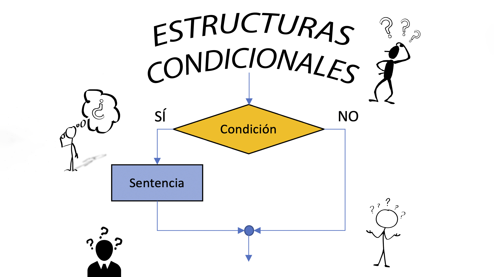
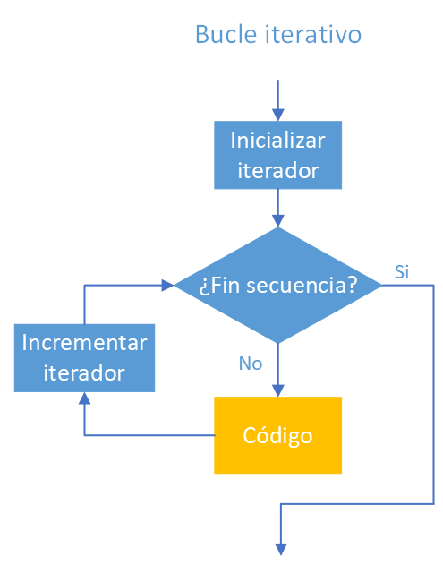
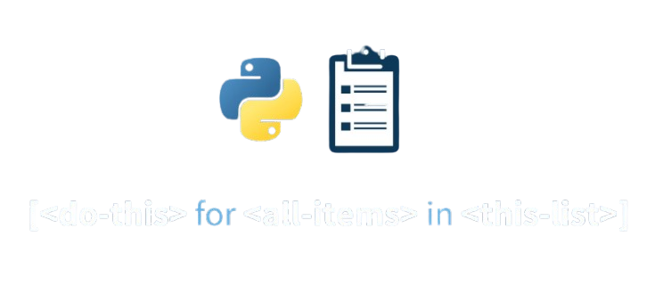
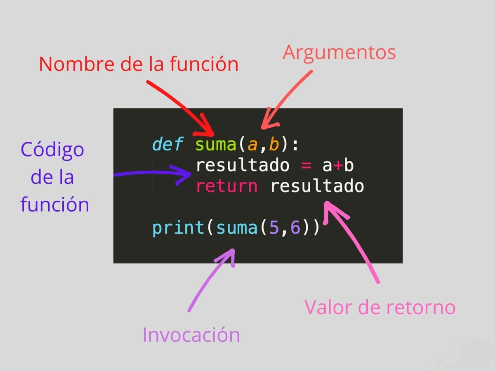
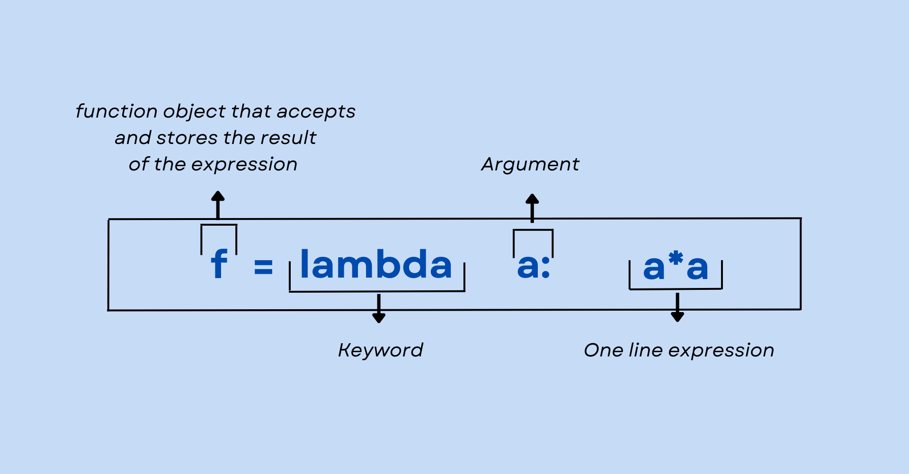

# Guía de Conceptos Fundamentales en Python


## Índice

1. [ ¿Qué es Python?](#qué-es-python)
2. [ Comprendiendo los Condicionales en Python](#comprendiendo-los-condicionales-en-python)
3. [ Los Bucles en Python y su Importancia](#los-bucles-en-python-y-su-importancia)
4. [ Comprensión de Listas](#comprensión-de-listas)
5. [ Argumentos en Python: pasando información a las funciones](#argumentos-en-python-pasando-información-a-las-funciones)
6. [ Funciones Lambda](#funciones-lambda)
7. [ Gestión de Paquetes con pip](#gestión-de-paquetes-con-pip)

## 📘 ¿Que es Python?

**Python** es un **lenguaje de programación de alto nivel** que se utiliza para desarrollar aplicaciones de todo tipo. A diferencia de otros lenguajes como Java o .NET, se trata de un **lenguaje interpretado**, es decir, que no es necesario compilarlo para ejecutar las aplicaciones escritas en Python, sino que se ejecutan directamente por el ordenador utilizando un programa denominado interpretador, por lo que no es necesario “traducirlo” a lenguaje máquina.

Además, se trata de un **lenguaje multiplataforma de código abierto** y, por lo tanto, gratuito, lo que permite desarrollar software sin límites. Con el paso del tiempo, Python ha ido ganando adeptos gracias a su sencillez y a sus amplias posibilidades, sobre todo en los últimos años, ya que facilita trabajar con **inteligencia artificial, big data, machine learning y data science**, entre muchos otros campos en auge.

Igual te preguntas **¿Como surgio Python?**

Para conocer la **historia de Python**, tenemos que remontarnos al **1989**, año en el que el informático holandés **Guido Van Rossum** empieza a desarrollar este lenguaje de programación. Lo hace basándose en la iniciativa “ABC”, ejecutada por él anteriormente en el Centrum Wiskunde & Informatica (CWI), espacio en el que trabajaba en aquel momento.

Empezó a utilizarse en 1989, pero no fue hasta el **1991** cuando se hace pública y accesible a todas las personas la primera versión: la 0.9.0. Una versión en la que ya figuraba el funcionamiento modular.

El lenguaje ha experimentado **grandes avances en el desarrollo de código abierto**, utilizando las **PEP**s ("Propuestas de Mejora de Python") como principal herramienta para sugerencias de mejora y discusiones dentro de la comunidad.

Las **PEP**s se utilizan para describir cambios en el lenguaje o en sus normas, y son evaluadas por el público, aceptadas o rechazadas después de muchas discusiones. Cualquier persona puede escribir y enviar una PEP para su evaluación.

**¿Por qué el nombre ‘Python’ y no otro nombre?**

Según el creador Guido Van Rossum, el nombre de este lenguaje se deriva de la serie de comedia británica “Monty Python’s Flying Circus”. La comedia se emitió en la BBC durante la década de 1970 y le dio al creador alguna forma de entretenimiento durante el desarrollo del lenguaje. Además, Van Rossum quería un nombre que fuera corto y misterioso. Algo que captara la atención de todos.

## 🚀 Comprendiendo los Condicionales en Python

A menudo tenemos que tomar decisiones en nuestras vidas. Por ejemplo cuando digo “si llueve cojo el paraguas”, la acción de que coja el paraguas se producirá en caso de que se cumpla la condición de que está lloviendo. Esto traducido a la programación significa que cierta parte del código **sólo se ejecutará en caso de que se cumplan ciertas condiciones**.



 Las **sentencias condicionales** cumplen con dicha función. Nos ayudan a controlar el flujo de nuestro programa, decidiendo si unas líneas de código se tienen que ejecutar en función de si se cumplen unas condiciones preestablecidas. En concreto, **comprueban si una condición es verdadera o falsa** para tomar o no cierta acción.

### 🔹 ¿Para qué se usan los condicionales?
- Para ejecutar diferentes acciones según las condiciones dadas.
- Para validar datos antes de procesarlos.
- Para manejar errores y excepciones en el código.

### 🔹 Sintaxis y Uso de Condicionales

#### **1️⃣ Condición simple if**

La declaración **if** se usa para **evaluar una expresión**. Si la expresión dentro de esta condición es evaluada como **verdadera**, se ejecutará la instrucción definida dentro del bloque **if**; en caso contrario, si la expresión es **falsa**, la instrucción **no se ejecutará**. Es una forma de introducir **lógica condicional** en el código, permitiendo que ciertas acciones se realicen solo cuando se cumplen ciertas condiciones.

⚠️ Es importante señalar que la declaración condicional **if** en Python realiza una **conversión automática a booleano** de la expresión proporcionada.

```python
edad = 18
if edad >= 18:
    print("Eres mayor de edad")

# Output: Eres mayor de edad
```

📌 **Explicación:**
- Se declara una variable `edad` con valor `18`.
- La condición `edad >= 18` evalúa si la edad es mayor o igual a `18`.
- Como la condición es `True`, se ejecuta el bloque dentro del `if` y se imprime `Eres mayor de edad`.

#### 2️⃣ **Condición else**

En Python, la declaración **else** se utiliza en conjunto con una declaración **if**. La declaración else se ejecuta únicamente si la **condición evaluada por la declaración if resulta ser falsa**. En otras palabras, cuando la instrucción dentro del if no se ejecuta debido a que la condición es falsa, entonces la instrucción dentro del bloque else es la que se ejecuta. Esto proporciona una bifurcación en la lógica del programa, permitiendo definir acciones alternativas cuando la condición inicial no se cumple.


```python
edad = 16
if edad >= 18:
    print("Eres mayor de edad")
else:
    print("Eres menor de edad")

# Output:  Eres menor de edad
```

📌 **Explicación:**
- Se define `edad = 16`.
- La condición `edad >= 18` es `False`, por lo que se ejecuta el bloque `else`, imprimiendo `Eres menor de edad`.

#### 3️⃣ **Condición elif**

En Python, la declaración **elif** se emplea para especificar **condiciones adicionales** dentro de la estructura de un bloque **if**. Si la primera condición en el bloque if resulta ser falsa, el programa procederá a verificar la siguiente condición dentro de elif.

La declaración **elif** es útil para añadir situasiones adicionales a la evaluación, permitiendo así gestionar múltiples condiciones de manera organizada.

⚠️ Es importante destacar que es posible **anidar varias declaraciones elif** según la necesidad y criterio del desarrollador. Esto proporciona **flexibilidad** en la lógica del programa al permitir manejar diferentes escenarios en función de las condiciones evaluadas.


```python
nota = 8
if nota >= 9:
    print("Sobresaliente")
elif nota >= 5 and nota <=8:
    print("Aprobado")
else:
    print("Suspenso")

# Output: Aprobado
```

📌 **Explicación:**
- Se evalúa `nota`.
- Si `nota` es mayor o igual a `9`, se imprime `Excelente`.
- Si no, pero es mayor o igual a `5` y menor o igual a `8`, se imprime `Aprobado`.
- Si ninguna condición es `True`, se ejecuta el `else` y se imprime `Suspenso`.

#### ✅ **Buenas prácticas en condicionales**
- Utilizar paréntesis para mejorar la legibilidad en condiciones complejas
- Evitar anidaciones excesivas de `if-else`.
- Colocar las condiciones en la secuencia correcta, sobre todo si se usan sentencias como el `elif`, que valora los requisitos según el orden en el que se hayan escrito
- Usar operadores lógicos (`and`, `or`, `not`) para simplificar condiciones
- Realizar una indentación correcta


## 🔄 Los Bucles en Python y su Importancia

Los **bucles** sirven para que los programas **implementen iteraciones**, es decir, ejecuten un mismo bloque de código dos o más veces mientras se cumple la condición declarada. Cuando la condición llega a ser **falsa**, el programa **sale del bucle** y continúa con su ejecución de forma secuencial.



###  **Tipos de Bucles en Python**

Los bucles son comunes en los lenguajes de programación, y en lo que respecta a Python solo existen dos tipos: bucle **for** y bucle **while**. Ambas dependen del estado de la condición, es decir si es verdadera o falsa, pues así el bloque iterado responderá de una manera concreta.

####  🔹 **Bucle for** (Para recorrer estructuras de datos como listas, tuplas, string, etc.)

Cuando **se sabe el número exacto de repeticiones** del código en Python, se aplica el bucle `for`. La iteración depende de la cantidad de objetos recogidos en las líneas y que finalizará cuando se completen todos los valore de la lista.

El bucle `for` se crea de esta manera: `for<elem> in <iterable>: <bloque de código>`. En este caso, `elem` hace referencia a la **variable** de la que parte el iterador mientras que el `iterable` es el elemento sobre el que variable aplica el loop. En este caso, el bucle se repetirá hasta que se completen todos los valores de la secuencia de elementos del iterable.


```python
for num in range(3):
    print(f"Iteración {num}")

""" Output:
Iteración 0
Iteración 1
Iteración 2
"""
```

📌 **Explicación:**
- `range(3)` genera los números `0, 1, 2` (el 3 no está incluido).
- En cada iteración, `num` toma uno de estos valores y se imprime el mensaje "**Iteración**" seguido del valor actual de `num`.

####  🔹 **Bucle while** (Se ejecuta mientras una condición sea verdadera)

Es una **estructura de control** que **repite un bloque de código mientras se cumpla una condición específica**. Es uno de los bucles más comunes y se utiliza cuando no se sabe cuántas veces se necesita repetir un conjunto de instrucciones, pero sí la condición que debe cumplirse para continuar.

```python
contador = 0
while contador < 5:
    print(f"Contador: {contador}")
    contador += 1

""" Output:
Contador: 0
Contador: 1
Contador: 2
Contador: 3
Contador: 4
"""
```

📌 **Explicación:**

- Se inicializa la variable **contador** con el valor 0.
- Se ejecuta un bucle `while`, que se repetirá mientras la condición `contador < 5` sea `True`.

Dentro del bucle:
- Se imprime el valor actual de contador.
- Se incrementa contador en 1 (`contador += 1`).
- Cuando contador llega a 5, la condición `contador < 5` se vuelve **False** y el bucle termina.

⚠️ Es importante tener cuidado con las condiciones en los bucles while, ya que si la condición nunca se vuelve falsa, el bucle se ejecutará indefinidamente, lo que puede causar un **bucle infinito**.

### 🔹 **Sentencias break y continue**

Dentro de los bucles en Python, también podemos utilizar las sentencias **break** y **continue** para **controlar el flujo de ejecución**.

El **break** **termina el bucle** y ejecuta el bloque de código que está después del bucle.

Veamos un ejemplo utilizando `break` para salir de un bucle `for`:


```python
frutas = ["manzana", "banana", "cereza", "sandía", "uva"]

for fruta in frutas:
    print(fruta)
    if fruta == "sandía":
        break

""" Output:
manzana
banana
cereza
sandía
"""
```

📌 **Explicación:**

- Se define una `lista` llamada frutas con cinco elementos.
- Se inicia un bucle `for` que recorre cada fruta en la lista.

En cada iteración:
- Se imprime el nombre de la fruta.
- Se verifica si la fruta es **"sandía"**.
- Si se encuentra **"sandía"**, se ejecuta `break`, lo que **detiene el bucle** inmediatamente.
- Como resultado, **"uva"** nunca se imprime porque el bucle se interrumpe antes.

Por otro lado, el `continue` nos permite **saltar a la siguiente iteración** sin ejecutar el resto del bloque de código para esa iteración. Veamos un ejemplo:

```python
numeros = [1, 2, 3, 4, 5]

for numero in numeros:
    if numero % 2 == 0:
        continue
    print(numero)

"""
Output:
1
3
5
"""
```

📌 **Explicación:**

- Se define una lista de numeros con los valores [1, 2, 3, 4, 5].
- Se inicia un bucle `for` que recorre cada número en la lista.

Dentro del bucle:
- Se verifica si el número es par `numero % 2 == 0`
- Si el **número es par**, se ejecuta `continue`, lo que salta la iteración actual y **pasa al siguiente número**.
- Si el número es **impar**, **se imprime**.


### 🔹 **Buenas prácticas en bucles**
- Usar `break` para salir de un bucle antes de que termine.
- Usar `continue` para saltar una iteración.
- Evitar bucles infinitos controlando las condiciones adecuadamente.


## 📋 Comprensión de Listas



Una `lista de compresión` es una sintaxis concisa para crear una lista a partir de un **rango** o de un **objeto iterable**, aplicando una operación determinada a cada uno de sus elementos. Funciona mucho más rápido que sus alternativas, como los bucles for, las funciones lambda, las condicionales, etc.

🔹 **¿Cuando se usan las lista de compresión?**

Cuando necesitamos crear una lista Python a partir de un objeto rango o un iterable (otra lista, tupla, conjunto, etc.) aplicando una determinada operación sobre cada elemento del objeto de entrada. Funciona mejor cuando la expresión que se evalúa es relativamente sencilla. Dos casos particulares de uso de la comprensión de listas son filtrar un objeto de entrada y aplanar un iterable multidimensional (por ejemplo, una lista de listas).

### 🔹 Sintaxis básica

Los principales elementos de la sintaxis son los **corchetes** que rodean las **listas de compresión**, una **variable** que se refiere a cada elemento de una secuencia de entrada, una **expresión a evaluar**, la **colección** (o colecciones) de datos a la que se aplica la expresión, las palabras clave obligatorias **for** e **in**, las palabras clave **if**, **else**, **not** (cuando sea necesario), **operadores matemáticos** y **de comparación**.

Ejemplo de `comprensión de listas`:

```python
numeros = [x for x in range(10) if x % 2 == 0]
print(numeros)

# Output: [0, 2, 4, 6, 8]
```

📌 **¿Qué hace este código?**

- `Comprensión de listas`: se crea una lista de números utilizando una sintaxis compacta.
- `range(10)`: Genera los números del 0 al 9.
- `if x % 2 == 0`: Filtra los números para que solo se incluyan los pares (divisibles por 2 sin residuo).
- La `lista` generada se almacena en la **variable numeros**.
- Se imprime el resultado.

### 🔹 Ventajas del uso de las listas de compresión
- Código de una línea fácil de leer y depurar.
- Mejor rendimiento en comparación con bucles tradicionales.
- Espacio vertical optimizado en el programa.

#### **Generación de una lista de cuadrados**

```python
cuadrados = [x**2 for x in range(10)]
print(cuadrados)  # [0, 1, 4, 9, 16, 25, 36, 49, 64, 81]
```

#### **Comprensión de listas con cadenas**

```python
autores = ["jane austen", "george orwell", "james clear", "cal newport"]

author_list = [author.title() for author in authors]
print(lista_de_autores)

""" Output:
['Jane Austen', 'George Orwell', 'James Clear', 'Cal Newport']
"""
```

⚠️ El uso de la `comprensión de listas` resulta fundamental, ya que permite simplificar el código y minimizar la necesidad de recurrir a bucles **for** tradicionales, lo que contribuye a una mayor claridad y eficiencia en el rendimiento del programa. Esta técnica ofrece la posibilidad de aplicar filtros y transformaciones de manera directa y concisa, facilitando así la manipulación de datos sin comprometer la legibilidad.

## 🔧 Argumentos en Python: pasando información a las funciones

Los valores que se reciben una **función**  se denominan **parámetros**, pero durante la llamada los valores que se envían se denominan **argumentos**.



La **flexibilidad** y **adaptabilidad** que ofrecen las funciones Python en el manejo de `argumentos` es una característica única en el lenguaje, lo que lo convierte en una herramienta poderosa para el desarrollo de aplicaciones complejas.

### 🔹 Tipos de Argumentos en Python

Existen diferentes tipos de argumentos que se pueden pasar a una función en Python:

**1️⃣ Argumentos posicionales**

Son los argumentos que se envían a una función en el **orden en que se definieron**, es decir, el primer argumento será el primero que se envíe, el segundo será el segundo, y así sucesivamente.
Utilizar `argumentos posicionales` puede ser muy útil cuando se requiere una flexibilidad de argumentos, ya que, al enviar los argumentos en orden, no es necesario preocuparse por escribir la lista completa de argumentos y sus valores en la llamada a la función.

```python
def informacion_persona(nombre, edad, ciudad):
    print(f"{nombre} tiene {edad} años y vive en {ciudad}")

informacion_persona("Juan", 25, "Madrid")

# Output: Juan tiene 25 años y vive en Madrid
```

📌 **Análisis del código**

La **función informacion_persona** recibe tres **argumentos posicionales**, nombre, edad y ciudad. Al llamar a la función con informacion_persona("Juan", 25, "Madrid"), se enviaron los valores nombre="Juan", edad=25 y ciudad="Madrid", por lo que la función imprimirá: Juan tiene 25 años y vive en Madrid.

⚠️ Es **importante** notar que, aunque el orden en que se envían los argumentos es importante en las funciones con argumentos posicionales, también es posible definir valores por defecto para los argumentos en caso de no ser específicados en la llamada a la función.

```python
def informacion_persona(nombre, edad=18, ciudad="Desconocida"):
    print(f"{nombre} tiene {edad} años y vive en {ciudad}.")

informacion_persona("María")

# Output: María tiene 18 años y vive en Desconocida.
```

📌 **Análisis del código**

En este ejemplo, se define un valor por defecto de edad=18 y ciudad="Desconocida". Al llamar a la función con informacion_persona("María"), se envía el valor de nombre="María", pero no se envía ningún valor para edad ni ciudad, por lo que se utilizarán los valores por defecto definidos en la función. El resultado impreso por la función sería María tiene 18 años y vive en Desconocida.

❗ En conclusión, el uso de `argumentos posicionales` en Python brinda flexibilidad a las funciones al permitir una llamada más simple y ordenada para una variedad de argumentos. Además, se pueden definir valores por defecto para los argumentos en caso de no ser enviados en la llamada a la función.

**2️⃣ Argumentos con palabras clave**

Son aquellos que se definen mediante una palabra clave seguida de un signo igual y su valor correspondiente. Por ejemplo, en una función que recibe los argumentos nombre y edad, podríamos utilizar la siguiente sintaxis para llamar a la función:

```python
 mi_funcion(nombre="Juan", edad=25)
```

 Este tipo de argumentos proporcionan una mayor **claridad y legibilidad al código**.

 Ahora bien, ¿cómo podemos utilizar argumentos con palabras clave en Python? La respuesta es sencilla: basta con declarar los argumentos de nuestra función de la forma **argumento=valor**. Veamos un ejemplo sencillo:

```python
def suma_numeros(num1, num2, mostrar_resultado=False):
    resultado = num1 + num2
    if mostrar_resultado:
        print("El resultado de la suma es:", resultado)
    return resultado

resultado = suma_numeros(3, 4)
# Output: 7
resultado = suma_numeros(3, 4, mostrar_resultado=True)
# Output:  "El resultado de la suma es: 7" y asigna 7 a resultado
```

📌 **Análisis del código**

En este caso, nuestra función suma_numeros recibe dos números como argumentos (num1 y num2) y un parámetro opcional mostrar_resultado. Si no definimos este último parámetro, su valor por defecto será `False`. Si seteamos este parámetro a `True`, la función imprimirá en pantalla el resultado.

❗ Los **argumentos con palabras clave** son una herramienta muy útil en Python para hacer nuestro código más legible y adaptable. Para utilizarlos en nuestras funciones, basta con definir los argumentos de la forma **argumento=valor**. Con esta técnica, podemos hacer que nuestras funciones se adapten a diferentes situaciones sin tener que cambiar su lógica interna.

**3️⃣ Argumentos por defecto**

Son valores que se asignan a los parámetros de una función en caso de que **no se proporcionen valores** para ellos al llamar a la función. Esto puede ser útil para proporcionar un `valor predeterminado` que la función puede usar si no se proporciona un valor específico.

Para utilizar `argumentos por defecto` en Python, se puede proporcionar un `valor predeterminado` al definir los parámetros de una función. Por ejemplo, consideremos la siguiente función que toma dos argumentos y los **concatena**:

```python
def concatenar(a, b):
    return a + b
```

Si no se proporciona algún valor para los argumentos `a` y `b` al llamar a la función, se producirá un **error**. Para evitar esto, podemos proporcionar valores por defecto para `a` y `b`. Por ejemplo:

```python
def concatenar(a = "", b = ""):
    return a + b
```

En este ejemplo, se proporcionan dos valores por defecto para `a` y `b`. Si no se proporciona un valor para `a` o `b` al llamar a la función, se utilizarán estos valores predeterminados.

Usar valores por defecto como `""` en parámetros de tipo `str` es una **buena práctica** cuando queremos hacer funciones más **versátiles y fáciles de usar**.

⚠️ Es importante tener en cuenta que los valores por defecto solo se evalúan una vez, al definir la función. Esto significa que si se usa un objeto mutable (por ejemplo, una lista o un diccionario) como valor por defecto, se pueden producir **resultados inesperados**. En el siguiente ejemplo, se usará una lista como valor predeterminado para el parámetro **lista**:

```python
def agregar_elemento(elemento, lista=[]):
    lista.append(elemento)
    return lista
```

Al llamar a esta función **sin proporcionar una lista**, se **utilizará** la **lista predeterminada**:

```python
print(agregar_elemento(1))
# Output: [1]
```

Si llamamos a la función de nuevo con un **objeto diferente**, veremos que ambas llamadas a la función están añadiendo el elemento a la misma lista:

```python
print(agregar_elemento(2))
#Output: [1, 2]
```

⚠️ Para evitar este comportamiento inesperado, podemos utilizar un `valor por defecto` que no sea un objeto mutable. Por ejemplo, podemos usar `None` y luego dentro de la función creamos la lista o cualquier objeto que deseemos usar.

```python
def agregar_elemento(elemento, lista=None):
    if lista is None:  # Se crea una nueva lista en cada llamada si no se proporciona una
        lista = []
    lista.append(elemento)
    return lista

# Llamadas a la función
print(agregar_elemento(1))  # Output: [1]
print(agregar_elemento(2))  # Output: [2], no mantiene el estado anterior
print(agregar_elemento(3, [10, 20]))  # Output: [10, 20, 3], usa la lista proporcionada
```

✅ Buenas prácticas con valores por defecto en funciones:

-  Definir valores predeterminados adecuados según el tipo de dato esperado.
- Evitar valores por defecto mutables (como listas o diccionarios) a menos que sea intencional.
- Documentar la función con un docstring para describir su propósito y uso.

❗ El uso de **argumentos por defecto** puede ayudar a hacer que nuestras funciones sean más **flexibles** y **adaptativas** a diferentes casos de uso. Al proporcionar valores predeterminados para los parámetros, podemos **evitar errores** y **mejorar la usabilidad** de nuestras funciones.


**4️⃣ Argumentos variables**

Nos permiten trabajar con un **número indeterminado de elementos** que se pasan como argumentos a una función.

Los **argumentos variables** en Python se definen con el operador `*` antes del nombre del argumento, como por ejemplo `*args`, para las listas y tuplas, o con el doble operador `**`, como por ejemplo `**kwargs `, para los diccionarios.

 De esta manera, cuando se utiliza la función con estos argumentos variables se pueden pasar tantos elementos como se quiera. Por ejemplo, supongamos que deseamos definir una función que calcule el promedio de un conjunto de números. Eine forma de hacerlo es mediante una función que reciba una lista de elementos como argumento:

```python
def promedio(num):
    return sum(num) / len(num)

print(promedio([1, 2, 3, 4]))

# Output: 2.5
```

Sin embargo, si queremos calcular el **promedio** de un número indeterminado de elementos, debemos utilizar argumentos variables. Para ello, simplemente agregamos un * delante del nombre del argumento, y luego podemos trabajar con él como si se tratara de una lista:

```python
def promedio(*args):
    return sum(args) / len(args)

print(promedio(1, 2, 3, 4)) # output: 2.5
print(promedio(1, 2)) # output: 1.5
print(promedio(3, 6, 9, 12, 15)) # output: 9
```

📌 **¿Qué hicimos aqui?**

En este caso, la **función promedio** recibe un **número indeterminado** de elementos. A continuación, se calcula la suma de estos elementos con `sum(args)` y se divide entre la cantidad de elementos con len(args).

Otra forma de manejar una cantidad variable de argumentos en Python es utilizando el doble operador **. Si usamos este operador antes del nombre de un argumento, Python creará un diccionario con los nombres de los argumentos como llaves y los valores como valores. Por ejemplo, considera la siguiente función imprimir_kwargs:

```python
def imprimir_kwargs(**kwargs):
    for key, value in kwargs.items():
        print(f"{key}: {value}")


imprimir_kwargs(nombre="Juan", edad=30)

""" Output:
nombre: Juan
edad: 30
"""
```

Podemos combinar ambas técnicas para crear una función que maneje tanto argumentos sin nombre como argumentos con nombre. Por ejemplo:

```python
def imprimir_todo(*args, **kwargs):
    for arg in args:
        print(arg)

    for key, value in kwargs.items():
        print(f"{key}: {value}")


imprimir_todo(1, 2, 3, nombre="Juan", edad=30)

""" Output:
1
2
3
nombre: Juan
edad: 30
"""
```

❗ Python ofrece una gran flexibilidad en cuanto al manejo de argumentos en funciones. Podemos utilizar argumentos de longitud variable para crear funciones con mayor adaptabilidad y flexibilidad. Esto nos permite crear funciones más versátiles y eficientes en nuestro código.


## ⚡ Funciones Lambda

En Python, una **función lambda** se refiere a una pequeña **función anónima**. Las llamamos “funciones anónimas” porque técnicamente carecen de nombre.



Al contrario que una función normal, no la definimos con la palabra clave estándar `def` que utilizamos en Python. En su lugar, las funciones `Lambda` se definen como una línea que ejecuta una sola expresión. Este tipo de funciones pueden tomar cualquier número de argumentos, pero solo pueden tener **una expresión.**

### 🔹 Sintaxis básica

Todas las funciones Lambda en Python tienen exactamente la misma sintaxis:

` lambda argumentos : expresión`

### 🔹 Ejemplo de Función Lambda
Una de las ventajas de las funciones lambda es que pueden crear expresiones más compactas. En lugar de escribir una función con varias líneas de código, puedes escribir una función lambda en una sola línea de código.

Un ejemplo sencillo de esto es la creación de una función que eleve al cuadrado un número:

```python
def cuadrado(num):
    return num**2

# usando la función Lambda:

cuadrado_lambda = lambda num: num**2

print(cuadrado(5)) # Output: 25
print(cuadrado_lambda(5)) # Output: 25
```

Como se puede ver, la función lambda es mucho más compacta que la función normal.

Otra ventaja de las funciones lambda es que son muy flexibles. Pueden ser utilizadas en cualquier lugar donde se requiera una función, como parámetros de otras funciones, en expresiones aritméticas o en la definición de estructuras de datos como listas y diccionarios.

```python
numeros = [1, 2, 3, 4, 5]

resultado = list(map(lambda x: x**2, numeros))

print(resultado) # Output: [1, 4, 9, 16, 25]
```

📌 **¿Qué hicimos aqui?**

Hemos utilizado la función `map` para aplicar la función `lambda` que devuelve el **cuadrado** de un número a cada elemento de la lista numeros. El resultado es una **nueva lista** con los valores elevados al cuadrado.

### 🔹 ¿Cuándo Usarlas?

Las funciones **lambda** son una forma compacta de crear pequeñas funciones anónimas en Python. Son especialmente útiles cuando necesitamos crear una función rápida o sencilla en tiempo de ejecución sin tener que escribir todo el código de una función definida normal.

💡 Un ejemplo de uso común es con la función built-in **filter()**, la cual recibe una función como argumento que devuelve un valor **booleano**:

```python
numeros = [1, 2, 3, 4, 5, 6, 7, 8, 9, 10]
pares = list(filter(lambda x: x%2==0, numeros))
print(pares)

# Output: [2, 4, 6, 8, 10]
```

📌 **¿Qué hicimos aqui?**

- `filter()` retorna una lista con aquellos elementos de la secuencia que, al ser aplicados a la función, resultan en un valor `True`.
- para filtrar los números pares de una lista, hemos usado la función lambda `lambda x: x%2==0` la cual retorna `True`  cuando el número es par.

💡 Otro ejemplo de aplicación es con la función **map()**, la cual aplica una función a cada uno de los elementos de una secuencia.

```python
numeros = [1, 2, 3, 4, 5]
cuadrados = list(map(lambda x: x**2, numeros))
print(cuadrados)

# Output: [1, 4, 9, 16, 25]
```

📌 **Análisis del código**

- Para obtener el cuadrado de todos los números de una lista, hemos usado la función lambda `lambda x: x**2` en combinación con `map()`

💡 También podemos usar funciones lambda en combinación con la función **sorted()** para **ordenar una lista** de acuerdo a un criterio específico

```python
palabras = ["manzana", "banana", "durazno", "kiwi"]
ordenado_por_longitud = sorted(palabras, key=lambda x: len(x))
print(ordenado_por_longitud)

# Output: ["kiwi", "banana", "durazno", "manzana"]
```

📌 **¿Que hemos hecho?**

- ordenar una lista de strings de acuerdo a su longitud, usando la función lambda `lambda x: len(x)`

❗ Es importante considerar cuidadosamente el uso de funciones lambda en un proyecto. Aunque son muy útiles para crear expresiones funcionales compactas, no deben reemplazar completamente a las funciones convencionales y se deben utilizar solo en situaciones específicas en las que se requieren funciones pequeñas y simples. También es importante tener en cuenta consideraciones de legibilidad, eficiencia y manejo de excepciones al utilizarlas en el código.


## 📦 Gestión de Paquetes con pip

`pip` es el **administrador de paquetes de Python**, su nombre proviene de `“Pip Installs Packages”`. Con `pip`, podemos **instalar, actualizar y desinstalar** paquetes de Python de manera sencilla.


El sistema de gestión se asegura de que todas las dependencias se instalan correctamente y siempre mantiene todo actualizado. Además, `pip` tiene una gran cantidad de paquetes disponibles, por lo que siempre puede encontrar lo que necesita.

### 🔹 Instalación y actualización de pip

En la mayoría de las distribuciones de Python modernas, pip ya está incluido de forma predeterminada. Sin embargo, para asegurarte de tener la última versión, puedes seguir estos pasos para instalar pip:

✅ **Verificar si pip está instalado:**

Primero verifica si `pip` esta instalado. Abre una terminal o línea de comandos y ejecuta el siguiente comando:

  ```sh
  pip --version
  ```

Si **pip está instalado**, verás información sobre la **versión**. Si no, verás un mensaje de error.


✅ **Instalar pip**:

Si `pip` no está instalado, podemos instalarlo utilizando el siguiente comando:

  ```sh
  # Para Windows:
  python get-pip.py

  # Para Linux o MacOS:
  sudo apt-get install python3-pip
  ```

✅ **Instalar un paquete:**

Para instalar un paquete, utilizamos el comando `pip install nombre_del_paquete`. Por ejemplo, para instalar `requests`, un paquete comúnmente utilizado para hacer solicitudes HTTP en Python:

  ```sh
  pip install requests
  ```

✅ **Desinstalar un paquete:**

Si ya no necesitamos un paquete, podemos desinstalarlo con `pip uninstall nombre_del_paquete`. Por ejemplo, para desinstalar `requests`:

  ```sh
  pip uninstall requests
  ```

✅ **Listar paquetes instalados:**

Podemos ver una lista de los paquetes instalados en nuestro entorno con `pip list´. Esto mostrará los paquetes y sus versiones.

  ```sh
  pip list
  ```

✅ **Actualizar un paquete:**

Para actualizar un paquete a su última versión, utilizamos `pip install --upgrade nombre_del_paquete`.

  ```sh
  pip install --upgrade requests
  ```

✅ **Fichero requirements.txt:**

En muchos proyectos, es común tener un archivo requirements.txt que lista todos los paquetes y sus versiones necesarios para ejecutar el proyecto. pip puede instalar todos estos paquetes a la vez desde este archivo.

Supongamos que tenemos un archivo requirements.txt con el siguiente contenido:

  ```ini
  Flask==2.0.2
  requests==2.26.0
  numpy==1.21.2
  ```

Para instalar todos estos paquetes, ejecutamos:

  ```sh
  pip install -r requirements.txt
  ```

Esto instalará los paquetes Flask, requests y numpy con las versiones especificadas en el archivo.

### 🔹 Uso de una Biblioteca Instalada
Cuando instalamos una biblioteca en Python mediante **pip**, podemos importarla y utilizar sus funcionalidades dentro de nuestro código. A continuación, veremos un ejemplo en el que usamos la biblioteca `requests` para realizar una **solicitud HTTP a la API de GitHub**.

```python
import requests

# Realiza una solicitud GET a la API de GitHub
respuesta = requests.get("https://api.github.com")

# Imprime el código de estado de la respuesta
print(respuesta.status_code)
```

📌 **Análisis del código**

1️⃣ Importación de la biblioteca **import requests**

2️⃣ Realización de una solicitud **HTTP GET**

```python
respuesta = requests.get("https://api.github.com")

```

- Se usa `requests.get(url)` para hacer una solicitud **GET** a la **API** pública de GitHub.
- ` respuesta`  almacena la información devuelta por el servidor, incluyendo datos de la respuesta y el código de estado **HTTP**.

3️⃣ Impresión del código de estado

```python
print(respuesta.status_code)
```

- `respuesta.status_code` devuelve el código de estado HTTP de la solicitud.
- Algunos códigos de estado comunes son:
    - 200 → Éxito (OK)
    - 404 → No encontrado
    - 500 → Error en el servidor

✅ ¿Por qué es útil este código?
- Nos permite interactuar con APIs web y obtener información desde servidores remotos.
- Es útil para automatizar consultas, como obtener datos de redes sociales, clima, noticias, etc.
- La biblioteca requests simplifica las peticiones HTTP comparado con métodos más complejos como urllib.

❗ **Pip** es una herramienta muy poderosa que nos facilita enormemente la tarea de administrar las dependencias de nuestros proyectos. Además de la instalación de paquetes de terceros, Pip nos permite crear ambientes virtuales aislados y manejar paquetes privados de manera sencilla. En resumen, Pip es una de las herramientas básicas que todo desarrollador de Python debería conocer para optimizar su trabajo.

A lo largo de este recorrido, hemos cubierto lo esencial para empezar a programar en Python, desde el uso de condicionales hasta la creación de funciones y el manejo de bibliotecas externas. Python es un lenguaje poderoso y accesible, ideal tanto para principiantes como para desarrolladores experimentados.

💡 Y recuerda que un error en el código no es un fallo, **¡es una oportunidad para aprender algo nuevo!**


📚 Para más información, puedes consultar la [documentación oficial de Python](https://docs.python.org/es/3.13/tutorial/index.html).